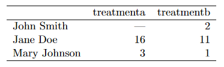
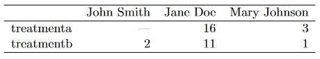
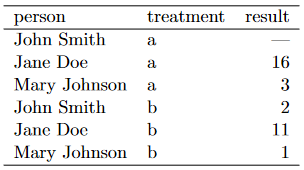

```{r xaringan-logo, echo=FALSE}
xaringanExtra::use_logo("https://drive.google.com/uc?id=1WbdosVvi6SBjYtEF6kHj-f0wotdHMRgw",link_url = "https://civicdatalab.in",exclude_class = NULL)
```

```{r xaringan-fit-screen, echo=FALSE}
xaringanExtra::use_fit_screen()
```

```{r xaringan-tile-view, echo=FALSE}
xaringanExtra::use_tile_view()
```


```{r xaringan-themer, include=FALSE, warning=FALSE}
library(xaringanthemer)
style_mono_accent(base_color = "#3F88C5",colors = c(
  red = "#f34213",
  purple = "#3e2f5b",
  orange = "#ff8811",
  green = "#136f63",
  white = "#FFFFFF"
))
```

# Onboarding - Things to do

- Check the [onboarding document](https://docs.google.com/document/d/1pLM15pna-MH-uy_pIsF5P9U1F8czBfOoTXWavLzrF7M/)
- Create an account on [Rocket Chat](chat.civicdatalab.in/)
- Take the [survey](https://forms.gle/jtCU8xa5Ud8JgJh7A)

---

# Session Structure

- Data Collection - How to
- Collecting data from secondary sources
  - The data biography
  - Structured vs Unstructured data sources
  - Collecting (structured) data from secondary sources
     - Working with CSV files
     - Extracting data from PDF files
     - Collecting data from the web
- Dealing with (messy) public datasets 
- Session 2 - Introduction
- Reading List

---

# Data Collection - How to ?

**Collecting it yourself** 

> The requirements for equitable data collection are complex. It’s not as simple as trying to ask everyone and not leave people out. Sample selection is important of course, but so is survey design, collector behaviour, scope and scale, cultural translation, collection mediums, data corruption, compatibility and fidelity and much more. It’s super worth doing, if for no other reason than your data will be more useful.<sup>1</sup>  

**.bg-purple[.white[Sourcing it from secondary data sources]]**

.footnote[
[1] [We All Count - Data Equity Framework](https://weallcount.com/the-data-process/)
]

---

# Secondary data sources

A few challenges we might face while using secondary data sources for research and analysis:

1. Data is not accessible.
2. Information and Knowledge gaps between data creators and data users.
3. Maintaining periodic datasets is hard and time consuming.
4. Cannot be used out of the box for research and analysis. 

> Now, if you’re sourcing data, rather than collecting it first hand, instead of a jewel, you’re probably better off considering the data a steaming pile of garbage. At least until you know it’s not. <sup>1</sup>

.footnote[
[1] [We All Count - Data Equity Framework](https://weallcount.com/the-data-process/)
]

---

# The data biography

Maintaining a _data biography_ at an org level really helps in making secondary datasets more accessible. 

> A comprehensive data biography – the where, why and how of any dataset – is absolutely crucial to equitable analysis. Get to know your data on the nitty-gritty, how-did-they-get-this, look-at-the-original-survey-wording, who-did-they-miss, level. When you really know your data and run it through the filter for potential bias and equity issues, you can begin to use facts and figures with confidence. You can maintain a buck-stops-here attitude towards ensuring inclusive, non-garbage, truthful data science. </sup>1</sup>

[A Data biography Template](https://docs.google.com/spreadsheets/d/1Ych5dzBfGLoQGYb-Jtq6VMn0PKdj_Y_tk6nGjopEduw/edit#gid=0)

---

# Structured vs Unstructured

```{r xaringan-panelset-1, echo=FALSE}
xaringanExtra::use_panelset()
```

.panelset[
.panel[
.panel-name[Difference]

**Structured data** is a lot easier to work with but often times we're limited with the scope of datasets. On the other hand, the process of converting **unstructured data** to a format that can be analysed is hard but it creates a lot of opportunities for research. 

> All data has some structure, but ‘structured data’ refers to data where the structural relation between elements is explicit in the way the data is stored on a computer disk <sep>1</sep>
 
]

.panel[

.panel-name[Use-cases]

1. [Criminal 'Injustice': How Courts Use 'Remand' to Penalise the Poor](https://www.thequint.com/news/law/how-delhi-courts-penalise-the-poor-through-mechanical-remand#read-more) - _Analysis of 153 remand orders_
2. [Sharp Fall in Citation of Supreme Court Judgments by Foreign Courts After 2014, Study Finds](https://thewire.in/law/supreme-court-foreign-citations-study) - _Analysis of Judgements from 43 countries_

]

.panel[
.panel-name[Types]

.pull-left[

Structured sources
  - Census of India
  - NCRB Database
  - National Judicial Data Grid (NJDG)
]

.pull-right[
Unstructured sources
  - Laws and Judgements
  - Newspaper Reports
  - Ethnographic summaries
]
]

]

.footnote[
[1] [Open Data Handbook - Glossary](https://opendatahandbook.org/glossary/en/terms/structured-data/)
]

---
class: center, middle

# Collecting .red[(structured)] data

---
class: center, middle

# Working with CSV files

---

# Why CSV

- One of the most widely used data formats

--

- Synonymous with open datasets

--

- Offers a lot of flexibility for building tools that aid in research and analysis


---

# Challenges with CSV's

- Not a standard way to create a CSV file.
    - CSVs generated from standard spreadsheets and databases as a matter of course use variable encodings, variable quoting of special characters, and variable line endings.

--

- CSV files are desperately poor at providing contextual information that can aid in automated processing of the data that they hold or even in informing developers about how they should be interpreted.

---

# A CSV file lacks context

> CSV is insufficient for tabular data on the web, with independent generic viewers, because it lacks this context. Not knowing which columns contain numeric data makes it impossible to sort correctly. Not knowing which values are links makes it impossible to connect the data into the web. Crucially, from an open data perspective, this lack of expressivity means there is no obvious way to express the licence under which CSV data can be reused. <sup>1</sup>

Focusing on the data entry and storage aspects, we can follow a set of best practices for organizing spreadsheet data to reduce errors and ease later analyses <sup>2</sup>

.footnote[
[1] [2014: The year of CSV](https://theodi.org/article/2014-the-year-of-csv/)

[2] [Karl W. Broman & Kara H. Woo (2018) Data Organization in Spreadsheets](https://doi.org/10.1080/00031305.2017.1375989)
]

---

# Core principles

- Be consistent

--

- Build a tidy dataset

--

- Create a data dictionary

--

- No calculations in the raw data files

--

- Don't use font color or highlighting as data

--

- Use data validation to avoid errors


---

# Be consistent

- Use consistent codes for categorical variables

- Use a single fixed code for any missing values

- Use consistent variable names<sup>1</sup>

- Use a single common format for all dates


.footnote[
[1] [Choose good names for things](https://kbroman.org/dataorg/pages/names.html)
]

---

# A tidy dataset

A **tidy dataset** is a standard way of mapping the meaning of a dataset to its structure.  A dataset is messy or tidy depending on how rows, columns and tables are matched up with observations,variables and types.  

In tidy data:
- Each variable forms a column.
- Each observation forms a row.
- Each type of observational unit forms a table.

---

# Building a tidy dataset

```{r xaringan-panelset-2, echo=FALSE}
xaringanExtra::use_panelset()
```
.panelset[
.panel[
.panel-name[Tidy Dataset]

A dataset is a collection of values, usually either numbers (if  quantitative) or strings (if qualitative). Values are organized in two ways. Every value belongs to a variable and an observation. A **variable** contains all values that measure the same underlying attribute (like height, temperature, duration) across units.  An **observation** contains all values measured on the same unit (like a person, or a day, or a race) across attributes. <sup>1</sup>

]

.panel[
.panel-name[Table 1]

]

.panel[
.panel-name[Table 2]

]

.panel[
.panel-name[Tidy Dataset]

]

.panel[
.panel-name[Variables vs Observations]
A general rule of thumb is that it is easier to describe functional relationships between variables (e.g.,z is a linear combination of x and y,density is the ratio of weight to volume) than between rows,  and it is easier to make comparisons between groups of observations (e.g., average of group a vs. average of group b) than between groups of columns.
]
]

.footnote[
[1] [Tidy data, Hadley Wickham](www.jstatsoft.org/v59/i10/paper)
]

---

# Create a data dictionary

_It’s helpful to have a separate file that explains what all of the variables are_

Such a “data dictionary”<sup>1</sup> might contain:

- The exact variable name as in the data file.
- A version of the variable name that might be used in data visualizations.
- A longer explanation of what the variable means.
- The measurement units.
- Expected minimum and maximum values, perhaps.

.footnote[
[1] [Data Dictionary - Justice Hub Docs](https://docs.justicehub.in/data-dictionary.html)
]

---


# No calculations in the raw data files

Often, the Excel files include all kinds of calculations and graphs. The primary data file should contain just the data and nothing else: **.red[no calculations, no graphs]**.

Your primary data file should be a pristine store of data. Write-protect it, back it up, and don’t touch it.

If you want to do some analyses in Excel, make a copy of the file and do your calculations and graphs in the copy.

---

# Don't use font color or highlighting as data


You might be tempted to highlight particular cells with suspicious data, or rows that should be ignored. Instead, add another column with an indicator variable (for example, "trusted", with values TRUE or FALSE)

---

# Dealing with data formatting issues
```{r xaringan-panelset-3, echo=FALSE}
xaringanExtra::use_panelset()
```

.panelset[.panel[.panel-name[Formatted Table]


]

.panel[.panel-name[Better alternative]


]
]

---

# Use data validation to avoid errors

CSV looks easy, but it can be hard to make a CSV file that other people can work with. [CSVLint](https://csvlint.io/),<sup>1</sup> helps you to check that your CSV file is readable. And you can use it to check whether it contains the columns and types of values that it should.

This service is maintained by an open source community and hosted by the [Open Data Institute (ODI)](https://theodi.org/).

.footnote[
[1] [CSVLint](https://csvlint.io/about)
]

---

```{r xaringan-panelset-4, echo=FALSE}
xaringanExtra::use_panelset()
```

# Common warnings and errors

.panelset[

.panel[.panel-name[Errors]

- Invalid encoding: if there are any odd characters in a file which could cause encoding errors
- Line breaks: if line breaks are not the same throughout the file
- Undeclared header: if you do not specify in a machine readable way whether or not your CSV has a header row
- Ragged rows: if every row in the file doesn't have the same number of columns
- Blank rows: if there are any blank rows
- Stray/Unclosed quote: if there are any unclosed quotes in the file
- Whitespace: if there is any whitespace between commas and double quotes around fields
]

.panel[.panel-name[Warnings]

- Encoding: if you don't use UTF-8 as the encoding for the file
- Check options: if the CSV file only contains a single comma-separated column; this usually means you're using a separator other than a comma
- Inconsistent values: if any column contains inconsistent values, for example if most values in a column are numeric but there's a significant proportion that aren't
- Empty column name: if all the columns don't have a name
- Duplicate column name: if all the column names aren't unique
- Title row: if there appears to be a title field in the first row of the CSV.
]
]

---

# Resources on dealing with CSV files

- Leek Group guide to data sharing](https://github.com/jtleek/datasharing)
- [Data Carpentry](http://datacarpentry.org/) lesson on [using spreadsheets](https://github.com/datacarpentry/excel-ecology)
- [Releasing statistics in spreadsheets (pdf)](https://gss.civilservice.gov.uk/wp-content/uploads/2012/12/Releasing-statistics-in-spreadsheets-Good-practice-guidance.pdf), by [UK Government Statistical Service](https://gss.civilservice.gov.uk/)
- [Video of Hadley Wickham talking about tidy data](http://vimeo.com/33727555)
- EP White et al. (2013) [Nine simple ways to make it easier to (re)use your data](http://ojs.library.queensu.ca/index.php/IEE/article/view/4608/4898). 
- [3 common bad practices in sharing tables and spreadsheets and how to avoid them](http://luisdva.github.io/pls-don't-do-this/)

---
class: center, middle

# Extracting data from PDF files

The essential feature of a portable document is that it looks the same (with exceptions for accessible views or views on mobile)wherever and whenever it is viewed or printed. This is a basis for reliable communication, when a document is sent, published, archived, or distributed, as the basis for further discussion<sup>1</sup>

.footnote[
[1] [Best Practices for PDF and Data:Use Cases, Methods, Next Steps](https://odileeds.org/blog/files/Best%20Practices%20for%20PDF%20and%20Data.pdf)
]

---
class: center, middle

# PDF for data and content


[Source](https://odileeds.org/blog/files/Best%20Practices%20for%20PDF%20and%20Data.pdf)

---

# Types of PDF

1. Machine Readable
2. Non Machine Readable (Scanned)

---

# Data extraction from content

Open source tools:

1. [Tabula](https://tabula.technology/)
2. [Camelot](https://github.com/camelot-dev/camelot)
   - [Excalibur](https://github.com/camelot-dev/excalibur) - A web interface for Camelot library

---

# Working with Tabula

**Objective** - _Collect data to analyse state level trends in victim compensation_

**Source** - [NALSA](https://nalsa.gov.in/statistics/r-o-victim-compensation-schemes-report)

**Input Dataset** - [Link](https://nalsa.gov.in/statistics/r-o-victim-compensation-schemes-report/r-o-victim-compensation-schemes-april-2019-to-march-2020)

**Output Dataset** - [Link](assets/tabula-victim-compensation-pdf.csv)

---

# Learning to use Tabula

<iframe width="560" height="315" src="https://www.youtube-nocookie.com/embed/of9680dgqIc" title="YouTube video player" frameborder="0" allow="accelerometer; autoplay; clipboard-write; encrypted-media; gyroscope; picture-in-picture" allowfullscreen></iframe>


---

# Excalibur Demo


---

# Collecting data from the web

Often times data is not made accessible using common file formats, but is present on the web in the form of HTML pages. To collect such datasets, a few approaches are widely adopted:

1 - Using API (Application Programming Interfaces) - These are URL's through which the data can be downloaded as per the user requirements. Not all data present on the web can be accessed via an API. The responsibility of creating an API is on the publisher/owner of the platform where the data resides.

2 - Human manual copy-and-paste

3 - **.bg-purple[.white[HTML Parsing]]**

---

```{r xaringan-panelset-5, echo=FALSE}
xaringanExtra::use_panelset()
```

# Web Scraping 101

.panelset[.panel[.panel-name[What]

Web scraping is the process of collecting the data from the World Wide Web and transforming it into a structured format. Typically web scraping is referred to an automated procedure, even though formally it includes a manual human scraping. <sup>1</sup>
]

.panel[.panel-name[Why]

- A vast majority of data are user-generated content, presented in unstructured HTML format.
- The data are typically dynamic and vary over the time.
-  All information is located on the Internet in human-readable format.
- The problem is not in accessing the data, but how to convert this information into the structured (think of tabular or spreadsheet-like) format.
]

.panel[.panel-name[Use-cases]

- Collecting data from websites like Wikipedia (There are ways to get access to structured information from Wiki Pages. Check [DBPedia](https://www.dbpedia.org/)).
- Collecting data from court websites which don't often provide access to case laws, orders and judgements. Projects such as [Court Listener](https://free.law/about/) and [IndianKanoon](indiankanoon.org/) work in the direction of making such datasets more accessible. 
- Building time-series datasets from dashboards which are updated on a periodic basis.
- Collecting data from government dashboards and websites.

and a lot more .... 
]]

.footnote[
[1] [An introduction to Statistical Programming Methods in R](https://smac-group.github.io/ds/web-scraping-in-r.html)
]

---

# Scraping data from the web - Ethically

- Read the [robots.txt](https://levelup.gitconnected.com/how-to-understand-a-robots-txt-file-667246d7fa18) file.
- Analyzing Sitemap files.
- Analyse crawl delay.
- Check site ToS/T&C before scraping.
- Contact the site owner if you plan on doing a large amount of scraping.
- Introduce some delay between page scrapes, even if the site does not have a specific crawl-delay entry.

Also check:
- [Ethics in Web Scraping](https://towardsdatascience.com/ethics-in-web-scraping-b96b18136f01) - More general rules for both the scraper and the site owner

---
```{r xaringan-panelset-6, echo=FALSE}
xaringanExtra::use_panelset()
```

# Web Scraping using Google Sheets
.panelset[

.panel[.panel-name[IMPORTDATA]

For retrieving structured datasets like CSV/TSV

Eg: Exploring a dataset from the [JusticeHub](https://justicehub.in/dataset/indian-kanoon-statistics/resource/02005017-cd9d-4fec-94d4-243b5e4f9fcb)

Syntax - `IMPORTDATA(url, delimiter, locale)`

Query - `=IMPORTDATA("https://justicehub.in/dataset/e48994b7-e77a-4fa1-869f-923dec3e4636/resource/02005017-cd9d-4fec-94d4-243b5e4f9fcb/download/top_sections.csv",",")`

]

.panel[.panel-name[IMPORTXML]

For extracting specific content from HTML pages

Eg: Getting a list of all present judges from the Madras High Court

Syntax - `IMPORTXML(url, xpath_query, locale)`

Query - `=IMPORTXML("http://www.hcmadras.tn.nic.in/prejudge.html","/html/body/div[1]/div[3]/div/ul/li")`
]

.panel[.panel-name[IMPORTHTML]

For extracting tables/lists from HTML

Eg: Extracting the list of states and union territories of India by crime rate, from [Wikipedia](https://en.wikipedia.org/wiki/List_of_states_and_union_territories_of_India_by_crime_rate)

Syntax - `IMPORTHTML(url, query, index, locale)` 
Query - `=IMPORTHTML("https://en.wikipedia.org/wiki/List_of_states_and_union_territories_of_India_by_crime_rate","table",1)`

]

.panel[.panel-name[IMPORTFEED]

For retrieving RSS feeds

Eg: Getting the list of the latest 50 blogs published on the [Vidhi website](https://vidhilegalpolicy.in/)

Syntax - `IMPORTFEED(url, [query], [headers], [num_items])`
Query - `=IMPORTFEED("https://vidhilegalpolicy.in/feed/","items","TRUE",50)`

]
]

---

# Public data is messy

[Here](https://github.com/Quartz/bad-data-guide) is a guide that might help you in dealing with a few common problems that we associate with datasets.

> Most of these problems can be solved. Some of them can’t be solved and that means you should not use the data. Others can’t be solved, but with precautions you can continue using the data. In order to allow for these ambiguities, this guide is organized by who is best equipped to solve the problem: you, your source, an expert, etc. In the description of each problem you may also find suggestions for what to do if that person can’t help you. <sup>1</sup> 

.footnote[
[1] [The Quartz guide to bad data](https://github.com/Quartz/bad-data-guide)
]

---

# Session 2 - Introduction

**Discussion Topics**

- Data standards

--

- When to scrape data vs when to build data standards

--

- Case Studies
  - Akoma Ntoso
  
--

  - Data standard for publishing crime statistics
  
---

# Reading List

1. [The Daily Shaping of State Transparency: Standards, Machine-Readability and the Confi guration of Open Government Data Policies](https://sciencetechnologystudies.journal.fi/article/view/60221/pdf_36)
2. [Responsible Data Handbook](https://the-engine-room.github.io/responsible-data-handbook/)
3. [A brief history of open data](https://www.paristechreview.com/2013/03/29/brief-history-open-data/)
4. [Science friction: Data, metadata, and collaboration](https://doi.org/10.1177%2F0306312711413314)
5. [From open data to information justice](https://dl.acm.org/doi/10.1007/s10676-014-9351-8)
6. [THE DATA EQUITY FRAMEWORK](https://weallcount.com/the-data-process/)

