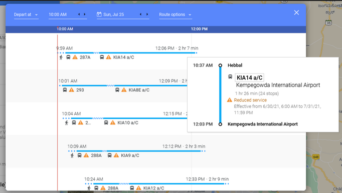

```{r xaringan-logo, echo=FALSE}
xaringanExtra::use_logo("https://drive.google.com/uc?id=1WbdosVvi6SBjYtEF6kHj-f0wotdHMRgw",link_url = "https://civicdatalab.in",exclude_class = NULL)
```

```{r xaringan-fit-screen, echo=FALSE}
xaringanExtra::use_fit_screen()
```

```{r xaringan-tile-view, echo=FALSE}
xaringanExtra::use_tile_view()
```

```{r xaringan-themer, include=FALSE, warning=FALSE}
library(xaringanthemer)
style_mono_accent(base_color = "#3F88C5",colors = c(
  red = "#f34213",
  purple = "#3e2f5b",
  orange = "#ff8811",
  green = "#136f63",
  white = "#FFFFFF"
))
```

# Session 1 - Recap

What we discussed
--

- Data Collection - How to (Primary vs Secondary)
- Collecting data from secondary sources
- The data biography (A must when using data from secondary data sources)
- Structured vs Unstructured data sources (Limited but easy to analyse vs Vast but hard to work with)

---

# Session 1 - Recap

- Collecting (structured) data from secondary sources
- Working with CSV files (Quite prone to certain data collection errors)
- Extracting data from PDF files (Working with Tabula)
- Collecting data from the web (Ethical web scraping)
- Using google sheets to scrape data from web pages

> Resources from all sessions can be accessed at [this link](https://civicdatalab.in/working-with-Data-Workshops/)


---

# Session 2 - Introduction

- Common issues with real-world datasets and how to resolve them
- Data collection use-cases
  - Supreme Court Judge Profiles
  - State wise mortality data from Devdatalab
- Data Standards
    - What
    - Why
    - Examples
    
---


# Public data is messy

[Here](https://github.com/Quartz/bad-data-guide) is a guide that will help you in dealing with a few common problems that we associate with datasets.


> Most of these problems can be solved. Some of them can’t be solved and that means you should not use the data. Others can’t be solved, but with precautions you can continue using the data. In order to allow for these ambiguities, this guide is organized by who is best equipped to solve the problem: you, your source, an expert, etc. In the description of each problem you may also find suggestions for what to do if that person can’t help you. <sup>1</sup> 

.footnote[
[1] [The Quartz guide to bad data](https://github.com/Quartz/bad-data-guide)
]

---

# Data collection use-cases

---

# Supreme Court Judge Profiles

Website - [https://main.sci.gov.in/chief-justice-judges](https://main.sci.gov.in/chief-justice-judges)

Requirement - Get judge profile details in a structured format

Challenges:

1. Direct download not available
2. Judge profile hidden behind a link
3. Current and Former judges are on different tabs but on the same URL

---

# Data scraping Alternatives

1. Crowd sourced data collection _More work for humans_
2. Training bots using AI _Challenge with implementation and accuracy of information_
3. Creating data standards _More work for data publishers_

> If your goal is to build something that’s going to be collecting data for a long time, like a government monitoring tool, think about how to identify, rally around, and target common standards. There’s some momentum for building shared code on top of shared data, and we’re starting to see real success stories. And so my closing message is to think long-term about how you collect the data; don’t plan on scraping forever. <sup>1</sup>

.footnote[
[1] [Monitoring Legislatures: The Long Game](https://medium.com/@jpmckinney/monitoring-legislatures-the-long-game-cefa4904ee81)
]

---

# Open data standards - What

> An open data standard is a set of specifications (or requirements) for how some sets of data should be made publicly available. <sup>1</sup>

.footnote[
[1] [Open data standards directory](https://datastandards.directory/glossary)
]

---

# Open data standards - Why

- Scraping is unsustainable
- Machine-readable data is not enough
- To standardise data collection across time and space - - _A shared language_ that allows error free data exchange
- For generating more interoperable datasets
- Opportunity for a dialogue between consumers and producers of datasets

---

# What can be standardised


Source: [The Open Data Institute](https://theodi.org/)

---

# Open data standards - Examples

```{r xaringan-panelset-1, echo=FALSE}
xaringanExtra::use_panelset()
```

.panelset[

.panel[.panel-name[Legislature]

| Title | Description |
|---|---|
| Popolo | The standard was designed as a simple and transferable vocabulary for sharing international government open data |
| Akoma Ntoso | Akoma Ntoso introduces common structures and ontologies for parliamentary, legislative and judiciary documents. These include parliamentary debates, committee briefs, and the entire life-cycle of a piece of legislation |

]

.panel[.panel-name[Crime]

| Title | Description |
|---|---|
| International Classification of Crime for Statistical Purposes (ICCS) | The ICCS provides a comprehensive framework for producing statistics on crime and criminal justice. |

]

.panel[.panel-name[Transit]

| Title | Description |
|---|---|
| General Transit Feed Specification (GTFS) | GTFS allows public transportation agencies to provide application developers with real-time updates about the locations, estimated arrival times and other important information regarding transit vehicles. |

]

.panel[.panel-name[Finance]

| Title | Description |
|---|---|
| Open Contracting Data Standard (OCDS) | For disclosing public procurement data in open formats about contracting processes from planning to implementation stage. |

]

]

---

# Exploring Data Standards

---

# Popolo

_International open government data specifications_

Specification - [https://www.popoloproject.com/](https://www.popoloproject.com/)

- For storing data related to elected officials
- Platforms like [EveryPolitician](https://everypolitician.org/) that have data for elected officials from 233 countries use the format for storing info
- OpenAustralia developed [TheyVoteforyou](https://theyvoteforyou.org.au/), a legislative vote tracking tool, to import Popolo data

[Link](https://cdn.rawgit.com/everypolitician/everypolitician-data/829796bc2c9693efb67d39312a22ce674aa4a8b1/data/India/Lok_Sabha/ep-popolo-v1.0.json
) to explore data for the members of the 16th Lok Sabha. 

---

# Akoma Ntoso

.red[A]rchitecture for .red[K]nowledge-.red[O]riented .red[M]anagement of .red[A]frican .red[N]ormative .red[T]exts using .red[O]pen .red[S]tandards and .red[O]ntologies - _A data standard for parliamentary, legislative and judiciary documents_

Specification - [Akoma Ntoso](http://www.akomantoso.org/)

- Akoma Ntoso is an initiative of [Africa i-Parliament Action Plan](https://publicadministration.un.org/parliaments/#.XDxOKy2ZPOQ), a programme of UN/DESA.
- Schema explorer - [Link](https://schema.akomantoso.com/element/akomaNtoso)

---

# Video - The Akoma Ntoso Open Standard 

<iframe width="560" height="315" src="https://www.youtube-nocookie.com/embed/FxpCLerCrN0" title="YouTube video player" frameborder="0" allow="accelerometer; autoplay; clipboard-write; encrypted-media; gyroscope; picture-in-picture" allowfullscreen></iframe>

---

# Akoma Ntoso - Reading List

1. [An Open Platform for Laws: How adoption of open standards and tools can strengthen the rule of law](https://www.linkedin.com/pulse/open-platform-laws-how-adoption-standards-tools-can-strengthen-sen/)
2. [Are Indian laws really ‘open’?](https://blog.okfn.org/2017/07/11/are-indian-laws-really-open/)
3. [How The Law Factory turns the French parliamentary process into 300 version-controlled Open Data visualizations](https://blog.okfn.org/2014/06/25/gitlaw-how-the-law-factory-turns-the-french-parliamentary-process-into-300-version-controlled-open-data-visualizations/)
4. [Laws of India in the Akoma Ntoso format](https://github.com/nyaayaIN/laws-of-india)
5. [Indigo platform](https://blog.indiankanoon.org/2019/11/launching-laws-of-india-in-akoma-ntoso.html) deployed by IndianKanoon to manage the XML laws generated by the Nyaaya team  
6. [AkomaNtoso.io](https://akomantoso.io/) - _A resource on learning and using the Akoma Ntoso schema_
7. [a presentation on why XML is important in the context of parliamentary documents](http://www.last-jd.eu/wp-content/uploads/2013/03/opendatav3.pdf)

---

# ICCS

International Classification of Crime for Statistical Purposes (ICCS) - _To enhance the consistency and international comparability of crime statistics, and improve analytical capabilities at both the national and international levels_

Specification - [ICCS Version 1.0](https://unstats.un.org/unsd/classifications/Family/Detail/1000) [PDF](https://www.unodc.org/documents/data-and-analysis/statistics/crime/ICCS/ICCS_English_2016_web.pdf)

**An attempt by the UN to adopt a common data standard to respond to emerging data needs at national and international level, including data needs deriving from the  Sustainable Development Goals (SDGs) in the areas of crime, violence, justice and the rule of law under UNODC mandate.**

---

# GTFS

General Transit Feed Specification (GTFS) - _A common format for public transportation schedules and associated geographic information_

Specification - [GTFS Resource Center](https://gtfs.mobilitydata.org/spec/gtfs-schedule)

- One of the most commonly used and adopted data standard
- If the transit information is on Google Maps, then it means that it is stored as GTFS
- Made it easier for transport agencies across the globe to share their datasets - schedules, rotues, etc
- Made transit data more accessible to the citizens

---

# GTFS on google maps



---

# GTFS Links

- [Read more]([Evoloution](https://beyondtransparency.org/chapters/part-2/pioneering-open-data-standards-the-gtfs-story/) of the GTFS standard
) about how the GTFS standard evolved with time. 

- GTFS Datasets from selected cities can be accessed [here](https://dataspace.mobi/group/gtfs)

- [OpenMobilityData](https://transitfeeds.com/) gives access to GTFS feeds from around the world

---

# Data Standards - Other Resources

- [Guidebook by the ODI](https://standards.theodi.org/introduction/types-of-open-standards-for-data/)
    - [Podcast](https://standards.theodi.org/community/community-voices/)
- [Five critical questions for constructing data standards](https://www.timdavies.org.uk/2014/02/21/five-critical-questions-for-constructing-data-standards/)

---

# State wise mortality data from Devdatalab

Link to dataset - [Dropbox](https://www.dropbox.com/sh/y949ncp39towulf/AACJRhJs6uzbjkB6uM5O9mKga/mortality/csv?dl=0&subfolder_nav_tracking=1)

Objectives:

1. Explore the dataset on google sheets
2. Compare state wise mortality figures in the last three years using a line chart

---

# The Tyranny of Spreadsheets

Nearly 16,000 positive Covid cases had disappeared completely from the UK’s contact tracing system. Why had the cases disappeared? Apparently, **Microsoft Excel had run out of numbers.**

> It was an astonishing story that would, in time, lead me to delve into the history of accountancy, epidemiology and vaccination, discuss file formatting with Microsoft’s founder, Bill Gates, and even trace the aftershocks of the collapse of Enron. But above all, it was a story that would teach me about the way we take numbers for granted. 

Read the story, by Tim Harford,  [here](https://timharford.com/2021/07/the-tyranny-of-spreadsheets/)

---
