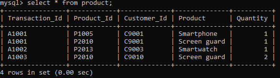

```{r xaringan-logo, echo=FALSE}
xaringanExtra::use_logo("https://drive.google.com/uc?id=1WbdosVvi6SBjYtEF6kHj-f0wotdHMRgw",link_url = "https://civicdatalab.in",exclude_class = NULL)
```

```{r xaringan-fit-screen, echo=FALSE}
xaringanExtra::use_fit_screen()
```

```{r xaringan-tile-view, echo=FALSE}
xaringanExtra::use_tile_view()
```

```{r xaringan-tachyons, echo=FALSE}
xaringanExtra::use_tachyons()
```

```{r xaringan-themer, include=FALSE, warning=FALSE}
library(xaringanthemer)
library(fontawesome)
style_mono_accent(base_color = "#A63A50",colors = c(
  red = "#f34213",
  purple = "#3e2f5b",
  orange = "#ff8811",
  green = "#136f63",
  white = "#FFFFFF",
  yellow = "#F1A208"
  ),link_decoration="underline",table_row_even_background_color = "#FFFFFF")

```


# Exercise - Web Scraping + Data Exploration

- [Link](https://nalsa.gov.in/dashboard/) to NALSA dashboard
- Create a CSV file with variables available under the Victim Compensation Schemes table for these states: 
    - Delhi
    - Maharashtra
    - Karnataka
    - West Bengal
    - Uttar Pradesh
- Create a chart to compare the yearly compensation numbers between these states
- Create a folder [here](https://drive.google.com/drive/u/0/folders/1W1t0j1NETZDQ5F7j7Ts6tDNiMQUTKGXD) and upload the dataset (including the chart) 

[Worksheet Link](https://docs.google.com/spreadsheets/d/1IEit4GN7w_d-a855qpa3_eq_J7PnVV5wL0OGu1_OXjo/edit#gid=199180986)

---
class: center, middle

# Working with databases

---

# Why to use a database ?

- Dealing with large datasets

- Platform agnostic

- Programming language agnostic

- Easy to share and maintain as compared to storing data as multiple data files

---

# A relational database

- Data stored as tables

- Each row in the table is a record with a unique ID called the key (Primary Key). 

- The columns of the table hold attributes of the data, and each record usually has a value for each attribute.

- Uses [SQL (Structured Query Language)](https://www.w3schools.com/sql/) to query ( _storing_, _manipulating_, _retrieving_) data

---

# Database terminologies

1.  **Schema** - _A database schema is the design of tables, columns, relations, and constraints that make up a logically distinct section of a database_. 
2. **Key** - _A key is a database field whose purpose is to uniquely identify a record_. Type off keys:
    - **Candidate Key** - _The set of columns that can each uniquely identify a record and from which the primary key is chosen._
    - **Primary Key** - _This key uniquely identifies a record in a table. It cannot be null.There can be only one Primary key in a table._
    - **Foreign Key** - _The key linking a record to a record in another table. A table's foreign key must exist as the primary key of another table._
4. **SQL** - _Structured Query Language, or SQL, is the most commonly used language to access data from a database_

---

# Understanding keys

```{r xaringan-panelset-1, echo=FALSE}
xaringanExtra::use_panelset()
```

.panelset[
.panel[
.panel-name[Table 1]


]

.panel[.panel-name[Candidate]


]

.panel[.panel-name[Primary]


]

.panel[.panel-name[Composite]


]
]

---

# Foregin Keys

.pull-left[


]

.pull-right[


]

---

# SQL Basics


---

# Database tools

---
class: center, middle

# Database exercises

---

# Exercise 1 - 

---

# Exploring data from eCourts

**Dataset** - [Link](https://www.dropbox.com/sh/hkcde3z2l1h9mq1/AADRe-BuBQ92ozAJiG7YERdCa?dl=0) - _The database contains 81.2 million cases_

**Source**: [Devdatalab](http://www.devdatalab.org/judicial-data)

**Objective**:

- Understand how the data is structured
- Import the data in a database
- Explore the sample datasets
- Find out the total cases present for each district for the year 2018

**Tags**

.bg-yellow[.black[_database_]]  .bg-yellow[.black[_large-datasets_]]  .bg-yellow[.black[_sqlite_]]  .bg-yellow[.black[_eCourts_]]  

---

# Tools 

1. [Sublime Text](https://www.sublimetext.com/) - _For text processing_
2. [SQLite Browser](https://sqlitebrowser.org/) - _For working with database_
3. [JSon Editor](https://jsoneditoronline.org/) - _For editing/viewing JSoN files_
4. [XML to JSON](https://codebeautify.org/xmltojson) - _For converting XML to JSON_
5. [jq](https://stedolan.github.io/jq/) - _For working with JSON files_
6. [Agenty](https://chrome.google.com/webstore/detail/agenty-advanced-web-scrap/gpolcofcjjiooogejfbaamdgmgfehgff) - _Chrome extension for scraping data_
7. [CSVLint](https://csvlint.io/) - _For validating CSV files_

---

**Exercise - Using Databases**

- Install SQLite DB Browser
- Create a new database
- Load the judges_clean dataset in the DB
- Find the distribution of male/female judges in **Bengaluru** district court where judge position is _chief metropolitan magistrate_
- Save the file, as CSV, in the drive

---

