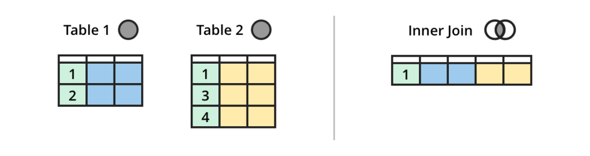

```{r xaringan-logo, echo=FALSE}
xaringanExtra::use_logo("https://drive.google.com/uc?id=1WbdosVvi6SBjYtEF6kHj-f0wotdHMRgw",link_url = "https://civicdatalab.in",exclude_class = NULL)
```

```{r xaringan-fit-screen, echo=FALSE}
xaringanExtra::use_fit_screen()
```

```{r xaringan-tile-view, echo=FALSE}
xaringanExtra::use_tile_view()
```

```{r xaringan-tachyons, echo=FALSE}
xaringanExtra::use_tachyons()
```


# SQL - Recap 👇

.center[
<iframe src="https://civicdatalab.in/Working-with-Data-Workshops/modules/module_2_data_exploration/session-2.html" frameborder="0" height="480" width="640" ></iframe>
]

---
## Exercise - Exploring data from eCourts

**Dataset** - [Link](https://www.dropbox.com/sh/hkcde3z2l1h9mq1/AADRe-BuBQ92ozAJiG7YERdCa?dl=0) - _The database contains 81.2 million cases_

**Source**: [Devdatalab](http://www.devdatalab.org/judicial-data)

**Objective**:

- Understand how the data is structured
- Import the data in a database
- Explore the sample datasets
- Find out the total cases present for each district for the year 2018

**Tags**

.bg-yellow[.black[_database_]]  .bg-yellow[.black[_large-datasets_]]  .bg-yellow[.black[_sqlite_]]  .bg-yellow[.black[_eCourts_]]  

--

.center[
.card[
```sql
SELECT 
	state_code, dist_code, count(*) AS total_cases 
FROM 
	cases_2018 
GROUP BY state_code, dist_code
```
]

]

---

## Exercise - Using Databases

- Install SQLite DB Browser
- Create a new database
- Load the judges_clean dataset in the DB
- Find the distribution of male/female judges in **Bengaluru** district court where judge position is _chief metropolitan magistrate_
- Save the file, as CSV, in the drive

--

.center[
.card[
```sql
SELECT 
	judge_position, female_judge, count(*) as total_judges
FROM 
	judges_clean
WHERE 
	state_code = 3 AND dist_code = 20 AND judge_position = 'chief metropolitan magistrate'
GROUP BY 
	judge_position, female_judge
```
]
]

---

# Working with Dates

Find the average duration of male and female judges appointed as `chief metropolitan magistrate` in the district courts of `BENGALURU`


--

.center[
.card[
```sql
SELECT 
	judge_position, female_judge, count(*) AS total_judges, 
	avg(
		julianday(substr(end_date,7,4) || '-' ||  substr(end_date,4,2) || '-' || substr(end_date,1,2)) - 
		julianday(substr(start_date,7,4) || '-' ||  substr(start_date,4,2) || '-' || substr(start_date,1,2))
		) as avg_judge_duration 
FROM judges_clean 
WHERE 
	state_code = 3 AND 
	dist_code = 20 AND 
	judge_position = 'chief metropolitan magistrate' 
	AND female_judge LIKE '%female%'
GROUP BY 
	judge_position, female_judge 
ORDER BY 
	avg_judge_duration desc
```
]
]

---

class: center, middle

# Working with SQL JOINS

---

# JOINing Tables

.bg-washed-red.b--dark-red.ba.bw2.br3.shadow-5.ph4.mt5[
A JOIN command is used where we need to query data that is spread across multiple tables
]

<br>

> Merging two data sets using SQL or SQL tools can be accomplished through JOINS. **A JOIN is a SQL instruction in the FROM clause** of your query that is used to identify the tables you are querying and how they should be combined.<sup>1</sup>

.footnote[
[1] [Dataschool](https://dataschool.com/how-to-teach-people-sql/sql-join-types-explained-visually/)
]
---

# Type of JOINs

.left-column[
### OUTER JOIN
]

.right-column[


.card[

SELECT *
FROM facebook
FULL OUTER JOIN linkedin
ON facebook.name = linkedin.name


]

.center[
[Example](https://dataschool.com/how-to-teach-people-sql/full-outer-join-animated/)
]

]

---

# Type of JOINs

.left-column[

### OUTER JOIN
### INNER JOIN

]

.right-column[


.card[

SELECT *
FROM facebook
JOIN linkedin
ON facebook.name = linkedin.name


]

.center[
[Example](https://dataschool.com/how-to-teach-people-sql/inner-join-animated/)
]

]

---

# Type of JOINs

.left-column[

### OUTER JOIN
### INNER JOIN
### LEFT JOIN

]

.right-column[


.card[

SELECT *
FROM facebook
LEFT JOIN linkedin
ON facebook.name = linkedin.name

]

.center[
[Example](https://dataschool.com/how-to-teach-people-sql/left-right-join-animated/)
]

]

---

# Type of JOINs

.left-column[

### OUTER JOIN
### INNER JOIN
### LEFT JOIN
### UNION JOIN


]

.right-column[


.card[

SELECT *
FROM facebook
UNION ALL
SELECT *
FROM linkedin

]

.center[
[Example](https://dataschool.com/how-to-teach-people-sql/union-animated/)
]

]

---

# Type of JOINs

.left-column[

### OUTER JOIN
### INNER JOIN
### LEFT JOIN
### UNION JOIN
### CROSS JOIN

]

.right-column[


.card[

SELECT *
FROM facebook
CROSS JOIN linkedin

]

.center[
[Example](https://dataschool.com/how-to-teach-people-sql/cross-join-animated/)
]


]

---

.center[


]

---
class: center, middle

# JOIN - Quiz

---
class: center


--

.card[

**INNER JOIN**

]
---
class: center


--


.card[

**UNION**

]

---
class: center


--


.card[

**OUTER JOIN**

]

---
## JOINS - Exercise 1

- Create a table that only contains cases registered with the Karnataka district courts
- Join the above table with `cases_district_key` to get district name
- Find the total number of cases in each district. Arrange the results in descending order
- Use a subquery to combine the two queries in one

--

.center[
.card[
```sql
SELECT a2.district_name, count(*) AS total_cases 
FROM (SELECT 
	a.*, b.district_name 
FROM 
	cases_2018_karnataka AS a 
LEFT JOIN
	cases_district_key AS b
ON a.state_code = b.state_code AND a.dist_code = b.dist_code) AS a2 
GROUP BY a2.district_name 
ORDER BY total_cases DESC
```
]
]


---
class: center, middle

# Other SQL Concepts

---
class: center

## CASE WHEN

.card[
**SELECT** City,
**CASE WHEN** City = "SF" **THEN** "San Francisco"
**ELSE** City
**END** AS "Updated City"  
FROM friends
]

--

.pull-left[

.bg-yellow[Example 1]

.card[
```sql
select month, year, deaths, 
	CASE 
	WHEN deaths < 5000 THEN "lt 5K"
	WHEN 5000<=deaths<10000 THEN "5K-10K"
	WHEN deaths > 10000 THEN "gt10K"
	END as "trends" 
FROM mortality_data;

```
]
]

.pull-right[

.bg-yellow[Example 2]


.card[
```sql
select month, year, deaths, 
	CASE 
	WHEN month = 1 THEN "Jan"
	WHEN month = 2 THEN "Feb"
	WHEN month = 3 THEN "Mar"
	WHEN month = 4 THEN "Apr"
	END as "monthName" 
FROM mortality_data 
WHERE
	month <= 4 AND 
	year= 2019 AND 
	state="Rajasthan";
```
]
]

---

## Subqueries

.bg-yellow[
Subquery in the **FROM clause**]

.card[

SELECT *
FROM (SELECT State, SUM (# of friends)
FROM facebook
GROUP BY state);

]

<br>
--

.bg-yellow[
Subquery in the **WHERE clause** ( _Returns single value_)
]

.card[
SELECT *
FROM facebook
WHERE # of friends = (SELECT MAX(# of connections)
FROM linkedin)

]

<br>
--

.bg-yellow[Subquery in the **WHERE clause** ( _Returns multiple values_)]

.card[

SELECT *
FROM facebook
WHERE # of friends IN (SELECT # of connections
FROM linkedin)

]

---

## EXERCISE - CASE WHEN & Subqueries

- Load [Mortality data](https://github.com/CivicDataLab/Working-with-Data-Workshops/blob/master/modules/module_2_data_exploration/data/mortality_data.csv) in the database
- Create a column to tag months where the total number of deaths was above or below average for the state of Rajasthan.
- The column can have only two values _Above average_ and _Below average_
- Sort the result dataset by year

--

.center[
.card[
```sql
select month, year, deaths, 
CASE WHEN 
	deaths < (select avg(deaths) as avg_deaths_RJ from mortality_data where state='Rajasthan') 
	THEN "belowAvg" 
	ELSE "aboveAvg" 
	END as "trends" 
FROM mortality_data where state='Rajasthan' order by year desc;
```
]
]

---
## JOINS - Exercise 2

Find the top 5 districts of Karnataka in terms of the number of cases that ended in conviction

--


.center[
.card[
```sql
SELECT d.*, e.district_name FROM (
SELECT c.dist_code, count(*) as total_convict_cases
FROM (
SELECT a.dist_code, a.disp_name, b.disp_name_s FROM 
	cases_2018_karnataka AS a 
LEFT JOIN
	disp_name_key AS b
ON 
	a.disp_name = b.disp_name) AS c
WHERE c.disp_name_s 
LIKE '%convict%' 
GROUP BY c.dist_code) as d 
LEFT JOIN 
	cases_district_key as e 
ON
	d.dist_code = e.dist_code 
WHERE 
	e.state_code = 3 
ORDER BY 
	total_convict_cases DESC LIMIT 5
```
]
]


---

## Regular Expressions (REGEX)

.center[

.card[
Regex, or Regular Expressions, is a sequence of characters, used to search and locate specific sequences of characters that match a pattern.
]
]

--

<br>

.center[
.bg-yellow[The **LIKE** clause]
]

.pull-left[

Find all states that start with letter `A`

.card[
```sql
SELECT distinct state 
FROM mortality_data 
WHERE state LIKE 'A%';

```
]

]

.pull-right[

Find all states that end with word `Pradesh`
.card[
```sql
SELECT distinct state 
FROM mortality_data 
WHERE state LIKE '%Pradesh';

```
]

]


---

## REGEX Exercise

1. Import [NCRB data](https://github.com/CivicDataLab/Working-with-Data-Workshops/blob/master/modules/module_2_data_exploration/data/ncrb.csv)
2. Find all crime heads related to `children` [can contain `child` or `children`]
3. Find all crime heads that mention `Murder`
4. Find all crime heads that start with `Murder`
5. Find all crime heads that are either `SLL` or `IPC` [ _REGEXP_ / _UNION_ ]

---

class: center, middle

# Queries and Feedback
