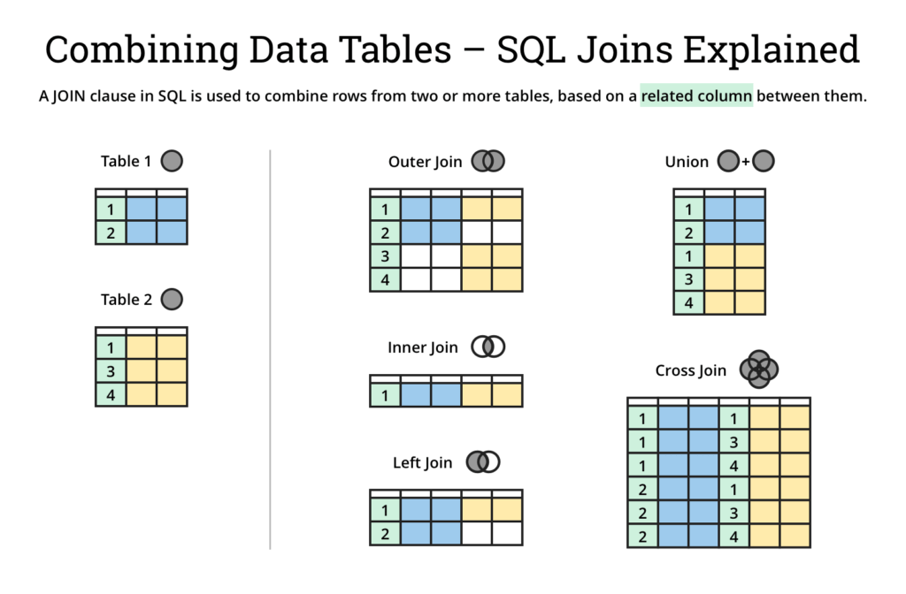

```{r xaringan-logo, echo=FALSE}
xaringanExtra::use_logo("https://drive.google.com/uc?id=1WbdosVvi6SBjYtEF6kHj-f0wotdHMRgw",link_url = "https://civicdatalab.in",exclude_class = NULL)
```

```{r xaringan-fit-screen, echo=FALSE}
xaringanExtra::use_fit_screen()
```

```{r xaringan-tile-view, echo=FALSE}
xaringanExtra::use_tile_view()
```

```{r xaringan-tachyons, echo=FALSE}
xaringanExtra::use_tachyons()
```

# JOINing Tables

.bg-washed-red.b--dark-red.ba.bw2.br3.shadow-5.ph4.mt5[
A JOIN command is used where we need to query data that is spread across multiple tables
]

<br>

> Merging two data sets using SQL or SQL tools can be accomplished through JOINS. **A JOIN is a SQL instruction in the FROM clause** of your query that is used to identify the tables you are querying and how they should be combined.<sup>1</sup>

.footnote[
[1] [Dataschool](https://dataschool.com/how-to-teach-people-sql/sql-join-types-explained-visually/)
]

---

.center[



]

---

## JOINS - Exercise 1

- Create a table that only contains cases registered with the Karnataka district courts
- Join the above table with `cases_district_key` to get district name
- Find the total number of cases in each district. Arrange the results in descending order
- Use a subquery to combine the two queries in one

--

.center[
.card[
.left[
```sql
SELECT a2.district_name, count(*) AS total_cases 
FROM (SELECT 
	a.*, b.district_name 
FROM 
	cases_2018_karnataka AS a 
LEFT JOIN
	cases_district_key AS b
ON a.state_code = b.state_code AND a.dist_code = b.dist_code) AS a2 
GROUP BY a2.district_name 
ORDER BY total_cases DESC
```
]
]
]

---
class: center, middle

# Other SQL Concepts

---
class: center

# CASE WHEN

.card[
**CASE WHEN** takes in values, checks them against a condition and **THEN** outputs values into a new column based on if it satisfies the condition.

CASE WHEN in SQL operates very similarly to “if then” statements in other programming languages.
]

--
.pull-left[
.bg-yellow[Example]

.card[
Create a new column as _defendant_type_ as per the values given in the female_defendant column. Use these rules:
- Tag female defendants as _female_
- Tag male defendants as _male_
- Tag all other defendants as _not_sure_
]
]

--

.pull-right[
.bg-yellow[Query]

.card[.left[
```sql
SELECT female_defendant, 
CASE
	WHEN female_defendant = '1 female' THEN 'female'
	WHEN female_defendant = '0 male' THEN 'male'
	ELSE 'not_sure' 
END AS defendant_type
FROM cases_2018_karnataka 
LIMIT 20
```
]]
]

---

## CASE WHEN - Examples

.pull-left[

.bg-yellow[Example 1]

Using the mortality dataset, categorise total number of deaths in a given month/year as _less than 5K_ , _between 5K and 10K_ and _greater than 10K_ 

.card[.left[
```sql
select month, year, deaths, 
	CASE 
  	WHEN deaths < 5000 THEN "lt 5K"
	  WHEN 5000<=deaths<10000 THEN "5K-10K"
	  WHEN deaths > 10000 THEN "gt10K"
	END as "trends" 
FROM mortality_data;

```
]
]
]

.pull-right[

.bg-yellow[Example 2]

On [Mortality data](https://github.com/CivicDataLab/Working-with-Data-Workshops/blob/master/modules/module_2_data_exploration/data/mortality_data.csv), assign names for months where month <=4 in the year 2019

.card[.left[
```sql
select month, year, deaths, 
CASE 
	WHEN month = 1 THEN "Jan"
	WHEN month = 2 THEN "Feb"
	WHEN month = 3 THEN "Mar"
	WHEN month = 4 THEN "Apr"
END as "monthName" 
FROM mortality_data 
WHERE
	month <= 4 AND 
	year= 2019 AND 
	state="Rajasthan";
```
]
]
]

---
# Subqueries

.center[
.card[The core concept to grasp is that the subquery is a separate SQL query that produces a table that is then used in the main query.]
]

--

.pull-left[

.bg-yellow[Objective]

.card[
Find the total number of cases in BENGALURU where petitioner is a female aggregated by judge position ( _Without Using JOINS_ )
]
]

--

.pull-right[

.bg-yellow[Query]

.card[
```sql
SELECT judge_position, count(*) AS total_cases
FROM cases_2018_karnataka
WHERE dist_code = (
	SELECT dist_code 
	FROM cases_district_key
	WHERE district_name = 'BENGALURU'
	) AND
	female_petitioner = '1 female'
GROUP BY judge_position 
ORDER BY total_cases DESC
```]
]

---

## Subqueries - Examples

.bg-yellow[
Subquery in the **FROM clause**]

.card[

SELECT *
FROM (SELECT State, SUM (# of friends)
FROM facebook
GROUP BY state);

]

<br>
--

.bg-yellow[
Subquery in the **WHERE clause** ( _Returns single value_)
]

.card[
SELECT *
FROM facebook
WHERE # of friends = (SELECT MAX(# of connections)
FROM linkedin)

]

<br>
--

.bg-yellow[Subquery in the **WHERE clause** ( _Returns multiple values_)]

.card[

SELECT *
FROM facebook
WHERE # of friends IN (SELECT # of connections
FROM linkedin)

]

---

## EXERCISE - CASE WHEN & Subqueries

- Load [Mortality data](https://github.com/CivicDataLab/Working-with-Data-Workshops/blob/master/modules/module_2_data_exploration/data/mortality_data.csv) in the database
- Create a column to tag months where the total number of deaths was above or below average for the state of Rajasthan.
- The column can have only two values _Above average_ and _Below average_
- Sort the result dataset by year

--

.center[
.card[.left[
```sql
select month, year, deaths, 
CASE WHEN 
	deaths < (select avg(deaths) as avg_deaths_RJ from mortality_data where state='Rajasthan') 
	THEN "belowAvg" 
	ELSE "aboveAvg" 
	END as "trends" 
FROM mortality_data where state='Rajasthan' order by year desc;
```
]
]
]

---
# Window Functions

.center[
.card[
Window functions create a new column based on calculations performed on a subset or _window_ of the data. This window starts at the first row on a particular column and increases in size unless you constrain the size of the window.
]
]

--

.pull-left[
.card[
```sql
SELECT 'Day', 'Mile Driving',SUM('Miles Driving') 
OVER(ORDER BY 'Day') AS 'Running Total'
FROM 'Running total mileage visual'
```
]
]

--

.pull-right[
.card[

]
]

---

## Window Functions - Use Cases

.center[

.bg-yellow[Creating additional columns]

Using [Mortality data](https://github.com/CivicDataLab/Working-with-Data-Workshops/blob/master/modules/module_2_data_exploration/data/mortality_data.csv), find if the total deaths in a state in a given month and year was above or below the average number of deaths in that year for a state

.card[
.left[
```sql
SELECT *, 
	CASE
		WHEN deaths < avg_deaths THEN 'Below Average'
		ELSE 'Above Average'
	END AS trends
FROM (
	SELECT *, AVG(deaths) OVER(PARTITION BY state,year) as avg_deaths
	FROM mortality_data
	)
```
]
]
]

---
## Window Functions - Use Cases

.center[

.bg-yellow[Ranking Items]

Assign ranks as per the total cases registered under each judge position **across all districts**

.card[
.left[
```sql
SELECT *, 
	RANK() over(ORDER BY total_cases DESC) AS ranking 
FROM 
	(
		SELECT dist_code, judge_position, count(*) AS total_cases 
		FROM cases_2018_karnataka
		GROUP BY dist_code,judge_position
	)

```
]
]
]

---

## PARTITION BY AND ORDER BY

.center[
.bg-yellow[Ranking with PARTITION BY]

<br>

.card[Ranking **within each district**]

.card[
.left[
```sql
SELECT *, 
	RANK() over(PARTITION BY dist_code ORDER BY total_cases DESC) AS ranking 
FROM 
	(
		SELECT dist_code, judge_position, count(*) AS total_cases 
		FROM cases_2018_karnataka
		GROUP BY dist_code,judge_position
	)
```
]
]
]

---
# Regular Expressions (REGEX)

.center[

.card[
Regex, or Regular Expressions, is a sequence of characters, used to search and locate specific sequences of characters that match a pattern.
]
]

--

<br>

.center[
.bg-yellow[The **LIKE** clause]
]

.pull-left[

Find all states that start with letter `A`

.card[
```sql
SELECT distinct state 
FROM mortality_data 
WHERE state LIKE 'A%';

```
]

]

.pull-right[

Find all states that end with word `Pradesh`
.card[
```sql
SELECT distinct state 
FROM mortality_data 
WHERE state LIKE '%Pradesh';

```
]

]


---

## REGEX Exercise

1. Import [NCRB data](https://github.com/CivicDataLab/Working-with-Data-Workshops/blob/master/modules/module_2_data_exploration/data/ncrb.csv)
2. Find all crime heads related to `children` [can contain `child` or `children`]
3. Find all crime heads that mention `Murder`
4. Find all crime heads that start with `Murder`
5. Find all crime heads that are either `SLL` or `IPC` [ _REGEXP_ / _UNION_ ]

---

## JOINS - Exercise 2

Find the top 5 districts of Karnataka in terms of the number of cases that ended in conviction

--


.center[
.card[
.left[
```sql
SELECT d.*, e.district_name FROM (
SELECT c.dist_code, count(*) as total_convict_cases
FROM (
SELECT a.dist_code, a.disp_name, b.disp_name_s FROM 
	cases_2018_karnataka AS a 
LEFT JOIN
	disp_name_key AS b
ON 
	a.disp_name = b.disp_name) AS c
WHERE c.disp_name_s 
LIKE '%convict%' 
GROUP BY c.dist_code) as d 
LEFT JOIN 
	cases_district_key as e 
ON
	d.dist_code = e.dist_code 
WHERE 
	e.state_code = 3 
ORDER BY 
	total_convict_cases DESC LIMIT 5
```
]
]
]

---

class: center, middle

# Queries and Feedback
