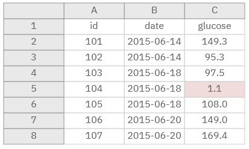
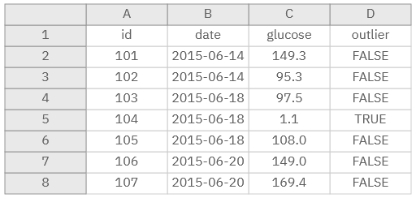

```{r xaringan-logo, echo=FALSE}
xaringanExtra::use_logo("https://drive.google.com/uc?id=1WbdosVvi6SBjYtEF6kHj-f0wotdHMRgw",link_url = "https://civicdatalab.in",exclude_class = NULL)
```

```{r xaringan-fit-screen, echo=FALSE}
xaringanExtra::use_fit_screen()
```

```{r xaringan-tile-view, echo=FALSE}
xaringanExtra::use_tile_view()
```

```{r xaringan-tachyons, echo=FALSE}
xaringanExtra::use_tachyons()
```

## Our Journey (Workshop Overview)


---

## Learning Objectives

A good session will be if by the end you:

1. Are aware about the **basic structure of a dataset**

--

2. Can describe any **tabular dataset** in terms of its features

--

3. Are aware about the **ways in which each data point can be stored in a file**

--

4. Can evaluate the **data quality** of any data set 

--

5. Have a basic understanding about **databases**

--

6. Can **read and write basic SQL queries**

--

7. Have a **pathway to develop your skills**


---

## A basic dataset

.center[.card[


]]

---

## Features of dataset

.pull-left[
.card[


<center>A tablular dataset </center>
]
]

--

.pull-right[

**Features** of a dataset:

1. Total Rows
2. Total Columns
3. Type of columns (Data Types)
  1. Categorical
  2. Numeric
  3. Text
  4. Date
]

---

## Quiz - Identify the features of a dataset


---

## Evaluating a dataset (Dataset Quality)

How to create a **good quality** dataset

1. Be consistent.

--

2. Formatting dates.

--

3. Fill in all of the cells.

--

4. Don’t use font color or highlighting as data.

--

5. Choose good names for things.

---
### Be Consistent

.center[.middle[.card[


</n> Sample Table
]
]
]

---

### Be Consistent - Principles

1. Consistent codes for categorical variables

--

2. Single fixed code for any missing values

--

3. Single common format for all dates

--

4. Extra spaces within cells

---

### Be Consistent -  The difference

.pull-left[

.middle[.card[


<center> Sample Table </center>
]
]
]

.pull-right[

.middle[.card[


<center>Formatted Table</center>
]
]
]

---
### Formatting dates

.center[.middle[.card[

]

.bg-washed-red.b--dark-red.ba.bw2.br3.shadow-5.ph4.mt5[

Be consistent in the way in which you write dates. And always use the YYYY-MM-DD format (or put the year, month, and day in separate columns).

]
]
]

---
### No empty cells

```{r xaringan-panelset-1, echo=FALSE}
xaringanExtra::use_panelset()
```

.panelset[

.panel[

.panel-name[Missing Values]


]

.panel[

.panel-name[Better alternative]


]
]


---
### Formatting data within files

```{r xaringan-panelset-3, echo=FALSE}
xaringanExtra::use_panelset()
```

.panelset[

.panel[

.panel-name[Formatted Table]



]

.panel[

.panel-name[Better alternative]


]
]

---

### Naming things

.pull-left[

.card[


</n>

<center> Variable Names </center>

]

]

--

.pull-right[

.card[


</n>

<center>File Names </center>

]


]

---

## Spreadsheet (Excel) vs Database 


---

## Database Tools


---
class: center, middle

## Structured Query Language (SQL)

---

## SQL Query

--- 

## SQL Functions

---

## SQL Examples

---

## Create and maintain a SQL project

---

## Day 1 - RECAP

--- 

## SQL Examples (Contd)

---

## SQL Functions

---

## Case Study

---

## SQL Puzzle

---

## Resources to learn and practice SQL


---
class: center, middle

# Queries and Feedback
