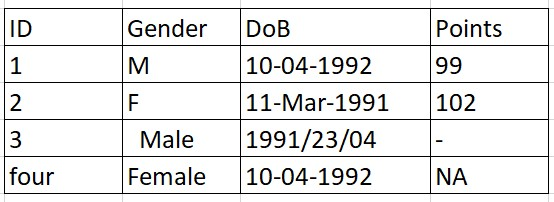

```{r knitr-opts, message=FALSE, warning=FALSE, include=FALSE}
knitr::opts_chunk$set(comment = NA)
```

```{r xaringan-extra-options, echo=FALSE}
xaringanExtra::use_logo("https://drive.google.com/uc?id=1WbdosVvi6SBjYtEF6kHj-f0wotdHMRgw",link_url = "https://civicdatalab.in",exclude_class = NULL)
xaringanExtra::use_fit_screen()
xaringanExtra::use_panelset()
xaringanExtra::use_tile_view()
xaringanExtra::use_tachyons()
```

```{r source-files, message=FALSE, warning=FALSE, include=FALSE}
source("../../scripts/utils.R")
```

```{r xaringan-themer, include=FALSE, warning=FALSE}
library(xaringanthemer)
library(fontawesome)
style_mono_accent(base_color = "#5b7aa1",link_decoration="underline")

```

---
class: center, middle

.card[
<b>View the slides at <a href='https://bit.ly/sql-sneha' target='_blank'>https://bit.ly/sql-sneha</a>
</b>


]

---
## Our Journey (Workshop Overview)

--

.center[
Over the next two days, we will learn about:
]

--

1. <b>A dataset</b>

--

2. <b>What makes a dataset more accesible</b>

--

3. <b>Analysing data in Excel</b>

--

4. <b>Database Tools</b>

--

5. <b>Reading and Writing Structured Query Language (SQL)</b>

--

6. <b>Analysing data using SQL</b>

---
## Learning Objectives

--

.center[
A good session will be if by the end you:
]

--

1. Are aware about the **basic structure of a dataset**

--

2. Can describe any **tabular dataset** in terms of its features

--

3. Are aware about the **ways in which each data point can be stored in a file**

--

4. Can evaluate the **data quality** of any data set 

--

5. Have a basic understanding about **databases**

--

6. Can **read and write basic SQL queries**

--

7. Have a **pathway to develop your skills**


---

## A basic dataset


.left-column[

.middle[.card[


<b>[palmerpenguins](https://allisonhorst.github.io/palmerpenguins/)</b>
]]]

.right-column[

<iframe title="palmerpenguins dataset" aria-label="Table" id="datawrapper-chart-38Mqw" src="https://datawrapper.dwcdn.net/38Mqw/1/" scrolling="no" frameborder="0" style="width: 0; min-width: 100% !important; border: none;" height="614" data-external="1"></iframe><script type="text/javascript">!function(){"use strict";window.addEventListener("message",(function(e){if(void 0!==e.data["datawrapper-height"]){var t=document.querySelectorAll("iframe");for(var a in e.data["datawrapper-height"])for(var r=0;r<t.length;r++){if(t[r].contentWindow===e.source)t[r].style.height=e.data["datawrapper-height"][a]+"px"}}}))}();
</script>

]

---

## Features of dataset

.pull-left[
.card[


<center><b>A tabular dataset</b></center>
]
]

--

.pull-right[

**Features** of a dataset:

1. Total Rows

2. Total Columns

3. Variables

4. Type of variables (Data Types)
  1. Categorical
  2. Numeric
  3. Text
  4. Date

]

---

## Quiz - Identify the features of a dataset

<br>

.center[
.card[


<a href='https://ndap.niti.gov.in/info' target='_blank'>National Data and Analytics Platform (or NDAP)</a> 
]
]

.center[.middle[
Dataset: <b><a href='' target='_blank'>Statewise Reproductive Child Health (RCH) Report Indicator Related to Maternal Health Antenatal Care (ANC)</a></b>
]]

---

## Evaluating a dataset (Dataset Quality)

How to create a **good quality** dataset

1. Be consistent.

--

2. Formatting dates.

--

3. Fill in all of the cells.

--

4. Don’t use font color or highlighting as data.

--

5. Choose good names for things.

---
### Be Consistent

.center[.middle[.card[


</n>
<b>Sample Table</b>
]
]
]

--

.bg-washed-red.b--dark-red.ba.bw2.br3.shadow-5.ph4.mt5[

Do you see any issues with this table ?

]

---

### Be Consistent - Principles

--

1. Consistent codes for categorical variables

--

2. Single fixed code for any missing values

--

3. Single common format for all dates

--

4. Extra spaces within cells

---

### Be Consistent -  The difference

.pull-left[

.middle[.card[


<center> Sample Table </center>
]
]
]

.pull-right[

.middle[.card[


<center>Formatted Table</center>
]
]
]

---
### Formatting dates

.center[.middle[.card[

]

.bg-washed-red.b--dark-red.ba.bw2.br3.shadow-5.ph4.mt5[

Be consistent in the way in which you write dates. And always use the YYYY-MM-DD format (or put the year, month, and day in separate columns).
<sup>1</sup>
]
]
]

.footnote[
[1][Dates as Data](https://datacarpentry.org/spreadsheets-socialsci/03-dates-as-data/index.html)
]

---
### No empty cells

```{r xaringan-panelset-1, echo=FALSE}
xaringanExtra::use_panelset()
```

.panelset[

.panel[

.panel-name[Missing Values]


]

.panel[

.panel-name[Better alternative]


]
]

---
### Formatting data within files

```{r xaringan-panelset-3, echo=FALSE}
xaringanExtra::use_panelset()
```

.panelset[

.panel[

.panel-name[Formatted Table]


]

.panel[

.panel-name[Better alternative]


]
]

---

### Naming things

.pull-left[

.card[


</n>

<center> <b>Variable Names</b> </center>

]

]

--

.pull-right[

.card[


</n>

<center><b>File Names</b> </center>

]
]

---

## Analysing data in Excel

.middle[
.pull-left[
.card[


</n>

<center> <a href="https://ndap.niti.gov.in/dataset/6000?tab=data">Primary Population Census 2011 </a> </center>
]
]

.pull-right[

**To-Do**

Link to the file - [Download from here](https://github.com/CivicDataLab/Working-with-Data-Workshops/raw/master/modules/module_2_data_exploration/data/census-2011-pca-ndap.csv)

1. Open the file in excel
2. Count the total number of districts
3. Find the district with the highest number of sub districts
4. Find the village with the highest number of households
5. Find the top 10 villages (**having at-least 50 households**) with highest percentage of:
  1. Female population
  2. Female literate population
  3. Female working population
]
]

---

## Database Tools

.center[.middle[
.pull-left[

**Database**
.card[


</n>

<a href="https://www.postgresql.org/" target="_blank">PostgreSQL</a>
]

]

.pull-right[
**Database Manager**

.card[


</n>

<a href="https://www.pgadmin.org/" target="_blank">pgAdmin</a>

]

]
]]

---

## Database Schema

.center[.middle[

.card[


</n> 

<b> A schema diagram </b>

]

]]

---

## Database Tables

.pull-left[.middle[

.card[


</n> 

<center><b> Tables in a database </b></center>

]

]]

--

.pull-right[.middle[

**Table Names**

1. `person`

2. `drivers_license`

3. `income`

]
]

---
class: center, middle

## Structured Query Language (SQL)

.bg-washed-red.b--dark-red.ba.bw2.br3.shadow-5.ph4.mt5[

**SQL** is the most commonly used language to access data from a database.

]

---
## SQL Query

.center[
.card[

</n> 

<center> Table Name: <b>employee</b><center> 

]

.bg-washed-red.b--dark-red.ba.bw2.br3.shadow-5.ph4.mt5[

SELECT * FROM employee

]
]

---
## SQL Query - SELECT

.center[
.card[

</n> 

<center> Table Name: <b>employee</b><center> 

]

.bg-washed-red.b--dark-red.ba.bw2.br3.shadow-5.ph4.mt5[

<b>SELECT</b> * FROM employee

]
]

---
## SQL Query - All

.center[
.card[

</n> 

<center> Table Name: <b>employee</b><center> 

]

.bg-washed-red.b--dark-red.ba.bw2.br3.shadow-5.ph4.mt5[

SELECT <b>*</b> FROM employee

]
]

---

## SQL Query - FROM

.center[
.card[

</n> 

<center> Table Name: <b>employee</b><center> 

]

.bg-washed-red.b--dark-red.ba.bw2.br3.shadow-5.ph4.mt5[

SELECT * <b>FROM</b> employee

]
]

---
## SQL Query - Select variable[s]

.center[
.bg-washed-red.b--dark-red.ba.bw2.br3.shadow-5.ph4.mt5[
SELECT <b>Name, Gender</b> FROM employee
]]

</br></br>

.pull-left[
```{r kable-1, echo=FALSE, message=FALSE, warning=FALSE}
kableExtra::kable(sample_df,align = "l")
```
]

--

.pull-right[
```{r kable-2, echo=FALSE, message=FALSE, warning=FALSE}
kableExtra::kable(sample_df[,c("Name","Gender")],align = "l")
```
]

---
## SQL Query - WHERE (Filter Table)

.center[
.bg-washed-red.b--dark-red.ba.bw2.br3.shadow-5.ph4.mt5[
SELECT <b>Name</b> FROM employee <b>WHERE gender='M'</b>
]]

</br></br>

.pull-left[
```{r kable-3, echo=FALSE, message=FALSE, warning=FALSE}
kableExtra::kable(sample_df,align = "l")
```
]

--

.pull-right[
```{r kable-4, echo=FALSE, message=FALSE, warning=FALSE}
kableExtra::kable(
  sample_df %>% filter(Gender == 'M') %>% select(Name), 
  align = "l")
```
]

---
## SQL Query - Sort Rows - Ascending

.center[
.bg-washed-red.b--dark-red.ba.bw2.br3.shadow-5.ph4.mt5[
SELECT <b>Name, Dep_Id</b> FROM employee <b>ORDER BY</b> Dep_Id
]]

</br></br>

.pull-left[
```{r kable-5, echo=FALSE, message=FALSE, warning=FALSE}
kableExtra::kable(sample_df,align = "l")
```
]

--

.pull-right[
```{r kable-6, echo=FALSE, message=FALSE, warning=FALSE}
kableExtra::kable(
  sample_df %>% select(Name,Dep_Id) %>% arrange(Dep_Id), 
  align = "l")
```
]

---
## SQL Query - Sort Rows - Descending

.center[
.bg-washed-red.b--dark-red.ba.bw2.br3.shadow-5.ph4.mt5[
SELECT <b>Name, Dep_Id</b> FROM employee <b>ORDER BY</b> Dep_Id <b>DESC</b>
]]

</br></br>

.pull-left[
```{r kable-7, echo=FALSE, message=FALSE, warning=FALSE}
kableExtra::kable(sample_df,align = "l")
```
]

--

.pull-right[
```{r kable-8, echo=FALSE, message=FALSE, warning=FALSE}
kableExtra::kable(
  sample_df %>% select(Name,Dep_Id) %>% arrange(desc(Dep_Id)), 
  align = "l")
```
]

---
## SQL Query - Limit Rows

.center[
.bg-washed-red.b--dark-red.ba.bw2.br3.shadow-5.ph4.mt5[
SELECT <b>Name, Gender</b> FROM employee <b>LIMIT 1</b>
]]

</br></br>

.pull-left[
```{r kable-9, echo=FALSE, message=FALSE, warning=FALSE}
kableExtra::kable(sample_df,align = "l")
```
]

--

.pull-right[
```{r kable-10, echo=FALSE, message=FALSE, warning=FALSE}
kableExtra::kable(
  sample_df %>% select(Name, Gender) %>% head(1), 
  align = "l")
```
]

---
## SQL Functions

.center[
.middle[
.card[

]
]
]

---
## SQL Query - Count all rows

.center[
.bg-washed-red.b--dark-red.ba.bw2.br3.shadow-5.ph4.mt5[
SELECT <b>COUNT(*)</b> FROM employee
]]

</br>

.center[.middle[
```{r kable-11, echo=FALSE, message=FALSE, warning=FALSE}
kableExtra::kable(sample_df,align = "l")
```
]]

--

.center[.middle[
<h3>
```{r total-row, echo=FALSE, message=FALSE, warning=FALSE}
  trows <- sample_df %>% nrow()
  cat(glue::glue("Total Rows -> {trows}"))
```
</h3>
]
]

---
## SQL Query - Count unique rows

.center[
.bg-washed-red.b--dark-red.ba.bw2.br3.shadow-5.ph4.mt5[
SELECT <b>COUNT(DISTINCT Gender)</b> FROM employee
]]

</br>

.center[.middle[
```{r kable-12, echo=FALSE, message=FALSE, warning=FALSE}
kableExtra::kable(sample_df,align = "l")
```
]]

--

.center[.middle[
<h3>
```{r total-unique-row, echo=FALSE, message=FALSE, warning=FALSE}
  trows <- sample_df %>% 
    select(Gender) %>% unique() %>% nrow()
  cat(glue::glue("Total Rows -> {trows}"))
```
</h3>
]
]

---
## SQL Query - Calculate SUM

.center[
.bg-washed-red.b--dark-red.ba.bw2.br3.shadow-5.ph4.mt5[
SELECT <b>SUM(Points)</b> FROM employee
]]

</br>

.center[.middle[
```{r kable-13, echo=FALSE, message=FALSE, warning=FALSE}
kableExtra::kable(sample_df,align = "l")
```
]]

--

.center[.middle[
<h3>
```{r total-sum, echo=FALSE, message=FALSE, warning=FALSE}
  tsum <- sample_df %>% 
    select(Points) %>% sum()
  cat(glue::glue("Total Sum -> {tsum}"))
```
</h3>
]
]

---
## SQL Query - Find Maximum value

.center[
.bg-washed-red.b--dark-red.ba.bw2.br3.shadow-5.ph4.mt5[
SELECT <b>MAX(Points)</b> FROM employee
]]

</br>

.center[.middle[
```{r kable-14, echo=FALSE, message=FALSE, warning=FALSE}
kableExtra::kable(sample_df,align = "l")
```
]]

--

.center[.middle[
<h3>
```{r max-row, echo=FALSE, message=FALSE, warning=FALSE}
  tmax <- sample_df %>% 
    select(Points) %>% max()
  cat(paste0(c("Maximum Points = ",tmax)))
```
</h3>
]
]

---
## SQL Quiz

.center[.card[
.bg-yellow[
.black[
Find the row with maximum number of points **without using MAX**
]
]]]

<br>

.center[.middle[
```{r kable-14-1, echo=FALSE, message=FALSE, warning=FALSE}
kableExtra::kable(sample_df,align = "l")
```
]]

--

.center[
.bg-green[ Hint: <b>Use ORDER BY and LIMIT</b> ]
]

--

.center[
.bg-washed-red.b--dark-red.ba.bw2.br3.shadow-5.ph4.mt5[
SELECT * FROM employee <b>ORDER BY points LIMIT 1</b>
]]

---
## SQL Query - GROUP BY 

.center[
.bg-washed-red.b--dark-red.ba.bw2.br3.shadow-5.ph4.mt5[
SELECT <b>Gender, COUNT(*) as Total</b> FROM employee <b>GROUP BY Gender</b>
]]

</br></br>

.pull-left[
```{r kable-15, echo=FALSE, message=FALSE, warning=FALSE}
kableExtra::kable(sample_df,align = "l")
```
]

--

.pull-right[
```{r kable-16, echo=FALSE, message=FALSE, warning=FALSE}
  trows <- sample_df %>% group_by(Gender) %>% summarise(Total=length(Gender)) %>% arrange(desc(Total))
  trows %>% kableExtra::kable()
```
]


---
## SQL Query - GROUP BY (SUM)

.center[
.bg-washed-red.b--dark-red.ba.bw2.br3.shadow-5.ph4.mt5[
SELECT <b>Dep_Id, sum(Points) as Total_Points</b> FROM employee <b>GROUP BY Dep_Id</b>
]]

</br></br>

.pull-left[
```{r kable-17, echo=FALSE, message=FALSE, warning=FALSE}
kableExtra::kable(sample_df,align = "l")
```
]

--

.pull-right[
```{r kable-18, echo=FALSE, message=FALSE, warning=FALSE}
kableExtra::kable(
  sample_df %>% group_by(Dep_Id) %>% summarise(Total_Points=sum(Points)), 
  align = "l")
```
]

---
## SQL Query - GROUP BY (MAX) + ORDER BY

.center[
.bg-washed-red.b--dark-red.ba.bw2.br3.shadow-5.ph4.mt5[
SELECT <b>City, MAX(Points) as max_Points</b> FROM employee <b>GROUP BY City ORDER BY max_Points DESC</b>
]]

</br></br>

.pull-left[
```{r kable-19, echo=FALSE, message=FALSE, warning=FALSE}
kableExtra::kable(sample_df,align = "l")
```
]

--

.pull-right[
```{r kable-20, echo=FALSE, message=FALSE, warning=FALSE}
kableExtra::kable(
  sample_df %>% group_by(City) %>% summarise(max_Points=max(Points)) %>% arrange(desc(max_Points)), 
  align = "l")
```
]

---
## SQL Query - GROUP BY + HAVING (Group Filter)
.center[
.bg-washed-red.b--dark-red.ba.bw2.br3.shadow-5.ph4.mt5[
SELECT 
  City, sum(Points) as total_Points
  FROM employee 
  <b>GROUP BY city HAVING sum(points) > 10</b> 
  ORDER BY total_points desc;
]]

</br></br>

.pull-left[
```{r kable-21, echo=FALSE, message=FALSE, warning=FALSE}
kableExtra::kable(sample_df,align = "l")
```
]

--

.pull-right[
```{r kable-22, echo=FALSE, message=FALSE, warning=FALSE}
kableExtra::kable(
  sample_df %>% group_by(City) %>% summarise(total_Points = sum(Points)) %>% filter(total_Points > 10) %>% arrange(desc(total_Points)),
  align = "l"
)
```
]

---
## Order of SQL commands

.center[.middle[

.card[


<center><b><a href='https://towardsdatascience.com/the-6-steps-of-a-sql-select-statement-process-b3696a49a642'>The 6 Steps of a SQL Select Statement Process
</a></b></center>

]

]]

---
## Analysing data using SQL

.middle[
.pull-left[
.card[


</n>

<center> <a href="https://ndap.niti.gov.in/dataset/6000?tab=data">Primary Population Census 2011 </a> </center>
]
]

.pull-right[

**To-Do**

1. Locate the table in the database and print the first 10 rows
2. Count the total number of districts
3. Select the top 10 districts with the highest number of sub districts
4. Select the top 10 villages with the highest number of households
5. Find the top 10 villages (**having at-least 50 households**) with highest percentage of:
  1. Female population
  2. Female literate population
  3. Female working population
]
]

---
## Query - 1

.center[
.bg-washed-red.b--dark-red.ba.bw2.br3.shadow-5.ph4.mt5[
Locate the table in the database and print the first 10 rows
]
]

--
</n>

.center[
.card[
.bg-yellow[
.black[
<b>SELECT * FROM census11 LIMIT 10</b>
]
]
]
]

--
</n>

.center[
```{r kable-23, echo=FALSE, message=FALSE, warning=FALSE}
kableExtra::kable(
  census_11 %>% 
    select(names(census_11[1:8])) %>% 
    head(5), 
  align = "l")
```
]

---
## Analyse data using SQL

.center[.middle[
**To-Do**

<s>1. Locate the table in the database and print the first 10 rows</s>

Count the total number of districts
]
]

---
## Query - 2

.center[
.bg-washed-red.b--dark-red.ba.bw2.br3.shadow-5.ph4.mt5[
Count the total number of districts
]
]

--
</n>

.center[
.card[
.bg-yellow[
.black[
<b>SELECT COUNT(DISTINCT district) as Total_Districts FROM census11</b>
]
]
]
]

--
</n>

.center[
```{r kable-24, echo=FALSE, message=FALSE, warning=FALSE}
kableExtra::kable(
  census_11 %>% select(District) %>% unique() %>% nrow() %>% data.frame() %>% setNames("Total_Districts"), 
  align = "l")
```
]

---
## Analyse data using SQL

.center[.middle[
**To-Do**

~~1. Locate the table in the database and print the first 10 rows~~

~~2. Count the total number of districts~~

Select the top 10 districts with the highest number of sub districts
]
]

---
## Query - 3

.center[
.bg-washed-red.b--dark-red.ba.bw2.br3.shadow-5.ph4.mt5[
Select the top 10 district with the highest number of sub districts
]
]

--
</n>

.center[
.card[
.bg-yellow[
.black[
<b>
  SELECT 
    district, COUNT(DISTINCT subdistrict) as Total_SubDistricts
    FROM census11 
    GROUP BY district 
    ORDER BY Total_SubDistricts DESC, district
  LIMIT 10
</b>
]
]
]
]

--
</n>

.center[
```{r kable-25, echo=FALSE, message=FALSE, warning=FALSE}
kableExtra::kable(
  census_11 %>% 
    group_by(District) %>% 
    summarise(Total_SubDistricts = n_distinct(SubDistrict)) %>%
    arrange(desc(Total_SubDistricts),District) %>% 
    head(10), 
  align = "l")
```
]

---
## Analyse data using SQL

.center[.middle[
**To-Do**

~~1. Locate the table in the database and print the first 10 rows~~

~~2. Count the total number of districts~~

~~3. Select the top 10 districts with the highest number of sub districts~~

Select the top 10 villages with the highest number of households
]
]

---
## Query - 4

.center[
.bg-washed-red.b--dark-red.ba.bw2.br3.shadow-5.ph4.mt5[
Select the top 10 villages with the highest number of households
]
]

--
</n>

.center[
.card[
.bg-yellow[
.black[
<b>
  SELECT 
    district, subdistrict,village_town, Households 
    FROM census11 
    WHERE rural_urban = 'Rural'
    ORDER BY Households DESC
  LIMIT 10
</b>
]
]
]
]

--
</n>

.center[
```{r kable-26, echo=FALSE, message=FALSE, warning=FALSE}
kableExtra::kable(
  census_11 %>% 
    filter(Rural_Urban == 'Rural') %>% 
    select(District, SubDistrict, Village_Town,Households) %>% 
    arrange(desc(Households)) %>% 
    head(10), 
  align = "l")
```
]

---
## Analyse data using SQL

.center[.middle[
**To-Do**

~~1. Locate the table in the database and print the first 10 rows~~

~~2. Count the total number of districts~~

~~3. Select the top 10 districts with the highest number of sub districts~~

~~4. Select the top 10 villages with the highest number of households~~

Find the top 10 villages (**having at-least 50 households**) with highest percentage of:
  
.bg-green[.white[<b>Female population</b>]]   
]
]

---

## Analyse data using SQL

.center[.middle[
**To-Do**

~~1. Locate the table in the database and print the first 10 rows~~

~~2. Count the total number of districts~~

~~3. Select the top 10 districts with the highest number of sub districts~~

~~4. Select the top 10 villages with the highest number of households~~

Find the top 10 villages (**having at-least 50 households**) with highest percentage of:
  
.bg-green[.white[<b>Female population</b>]]   .bg-green[.white[<b>Female literate population</b>]]  
]
]

---

## Analyse data using SQL

.center[.middle[
**To-Do**

~~1. Locate the table in the database and print the first 10 rows~~

~~2. Count the total number of districts~~

~~3. Select the top 10 districts with the highest number of sub districts~~

~~4. Select the top 10 villages with the highest number of households~~

Find the top 10 villages (**having at-least 50 households**) with highest percentage of:
  
.bg-green[.white[<b>Female population</b>]]   .bg-green[.white[<b>Female literate population</b>]]   .bg-green[.white[<b>Female working population</b>]]
]
]
---
## Query - 5 (Calculated fields)

.center[
.bg-washed-red.b--dark-red.ba.bw2.br3.shadow-5.ph4.mt5[
Find the top 10 villages, having at-least 50 households, with highest percentage of Female population
]
]

--
</n>

.center[
.card[
.bg-yellow[
.black[
<b>
  SELECT 
    district, subdistrict,
    village_town, (cast(femalepopulation as decimal)/population)*100 as percent_female_pop 
    FROM census11 
    WHERE rural_urban = 'Rural' AND households >= 50
    ORDER BY percent_female_pop DESC
  LIMIT 10
</b>
]
]
]
]

--
</n>

.center[
```{r kable-27, echo=FALSE, message=FALSE, warning=FALSE}
kableExtra::kable(
  census_11 %>% 
    filter(Rural_Urban == 'Rural' & Households>50) %>% 
    mutate(percent_female_pop=FemalePopulation/Population*100) %>% 
    arrange(desc(percent_female_pop)) %>%
    select(District, SubDistrict, Village_Town,percent_female_pop) %>%
    head(10), 
  align = "l")
```
]

---

## Case Study - Tracking field visits

.middle[
.pull-left[
.card[


<center><a href='https://snehamumbai.org/our-story/#:~:text=Brihanmumbai%20Municipal%20Corporation-,Areas%20of%20Work,-We%20work%20across' target='_blank'>Source: SNEHA</a></center>
]
]

.pull-right[


<b>To-Do</b>:

<center> <b>Filter out all cases which are closed</b> </center>

1. For each <b> cluster, center and CO (community organiser) </b>:

  1. Count the total number of pregnant women
  
  2. Count the number of high risk pregnancies 
  
  3. Find the distribution of pregnant women by month of pregnancy 

2. Find the cluster, center and CO with the highest number of pregnancies in the sixth and seventh month

3. For all women in this group, find the total number of field visits

4. For all women in the above group, count the total number of visits per month

]
]

---

## Case Study - Tracking field visits

.middle[
.pull-left[

<b>To-Do</b>:

1. For each <b> cluster, center and CO (community organiser) </b>:

  1. Count the total number of pregnant women
  
  2. Count the number of high risk pregnancies 
  
  3. Find the distribution of pregnant women by month of pregnancy 

2. Find the cluster, center and CO with the highest number of pregnancies in the sixth and seventh month

3. For all women in this group, find the total number of field visits

4. For all women in the above group, count the total number of visits per month

]

.pull-right[
.card[


<center><a href='' target='_blank'>SQL file</a></center>
]
]
]


---
## SQL Subqueries - Working with more than 1 table

.center[
.bg-washed-red.b--dark-red.ba.bw2.br3.shadow-5.ph4.mt5[
How many women with high risk pregnancy were visited at-least once in September, 2022
]
]

--

.center[
.bg-yellow[.black[
We don't have all the information in one table so we have to get information from multiple tables. 
]]
]

--

<center><b>Break the query</b></center>

--

.panelset[
.panel[.panel-name[Part 1]
Find the women with high risk pregnancy (current)

.center[.card[
.bg-yellow[
.black[

SELECT id FROM case_anc_visit_reduced WHERE closed=FALSE AND high_risk_preg='Yes'

]]]]

]

.panel[.panel-name[Part 2]
Find the women who were visited at-least once in September, 2022

.center[.card[
.bg-yellow[
.black[

SELECT DISTINCT(caseid) FROM form_anc_visit_reduced WHERE TO_CHAR(anc_visit_date,'YYYY-MM') = '2022-09'

]]]

<a href='https://dataschool.com/learn-sql/dates/' target='_blank'>Learn more about working with Dates</a>

]


]

.panel[.panel-name[Final Query]
Find the womenID which are present in both Part 1 and 2

.center[.card[
.bg-yellow[
.black[

SELECT id FROM case_anc_visit_reduced WHERE closed=FALSE AND high_risk_preg='Yes' AND <b>id IN (SELECT DISTINCT(caseid) FROM form_anc_visit_reduced WHERE TO_CHAR(anc_visit_date,'YYYY-MM') = '2022-09')</b>

]]]]

]
]
---
## SQL Detective

.center[.middle[.card[


<center><b><a href='https://mystery.knightlab.com/' target='_blank'>Source: knightlab</a></b></center>

]]

[SQL file]()

]

---
## Resources to learn and practice SQL

<iframe title="SQL Resources" aria-label="Table" id="datawrapper-chart-NKL6f" src="https://datawrapper.dwcdn.net/NKL6f/1/" scrolling="no" frameborder="0" style="width: 0; min-width: 100% !important; border: none;" height="559" data-external="1"></iframe><script type="text/javascript">!function(){"use strict";window.addEventListener("message",(function(e){if(void 0!==e.data["datawrapper-height"]){var t=document.querySelectorAll("iframe");for(var a in e.data["datawrapper-height"])for(var r=0;r<t.length;r++){if(t[r].contentWindow===e.source)t[r].style.height=e.data["datawrapper-height"][a]+"px"}}}))}();
</script>

<center>Click [here](https://raw.githubusercontent.com/CivicDataLab/Working-with-Data-Workshops/master/modules/module_2_data_exploration/data/sql-resources.csv) to download the list of resources</center>

---
class: center, middle

# Queries and Feedback

Format - Add feedback form
