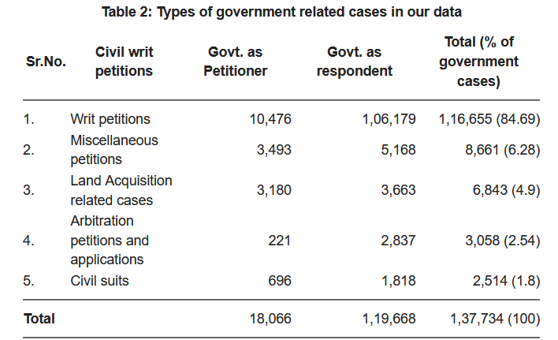
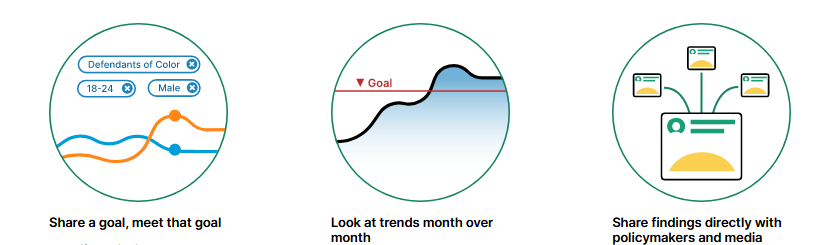
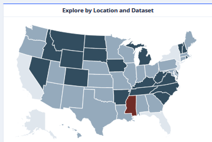

```{r xaringan-logo, echo=FALSE}
xaringanExtra::use_logo("https://drive.google.com/uc?id=1WbdosVvi6SBjYtEF6kHj-f0wotdHMRgw",link_url = "https://civicdatalab.in",exclude_class = NULL)
```

```{r xaringan-fit-screen, echo=FALSE}
xaringanExtra::use_fit_screen()
```

```{r xaringan-tile-view, echo=FALSE}
xaringanExtra::use_tile_view()
```

```{r xaringan-tachyons, echo=FALSE}
xaringanExtra::use_tachyons()
```

# What we will .bg-red[not] cover

1. This is not an introduction to Statistics
2. No, we'll not learn AI and ML
3. We will not learn about using the Microsoft Excel Analytics ToolPak addin
4. We will not use any additional analytical tools like Stata or SPSS to analyse data

---

# What .bg-green[we will cover] instead

1. In what ways can analysis of legal data help us
2. Common challenges with any data analysis project
3. Asking the right questions 
4. Data Analysis use cases
  1. Court Performance
  2. Case level analytics
  3. Comparing entities - Creating Indices
  4. Text Based Analysis
  5. Criminal Justice Data Explorers - Commons Project
  6. FBI Crime Data Explorer
  7. Human Rights Data Analysis Group (HRDAG)
5. How can we analyse the data in an un-biased way
6. The methodology matrix - What to use when

---

# Analysing legal data can help us in

1. Understanding how the judiciary functions
2. Creating more accountable institutions
3. Analysing the structural capacity of justice system across the country
4. Designing evidence-based judicial reforms
5. Designing better court/case management practices
6. Predict/Simulate the impact of laws on different stakeholders
7. Re-engineering judicial processes

and the list continues .... 

---

# But there are hurdles to cross

## Challenges associated with most data driven engagements that can lessen the intended impact:

1. Availability of granular datasets
2. Bias in data collection and analysis
3. Beneficiaries not in alignment with the proposed outcomes
4. Setting up a multidisciplinary team that: 
  1. Understands the context
  2. Has the right set of skills to analyse data
  3. Can publish with purpose
5. Ethical use of datasets
6. Sustainability
7. Periodic data updates

and the list continues as well .. 
 
---

# It starts with asking the right questions

> If I had only one hour to save the world, I would spend fifty-five minutes defining the questions, and only five minutes finding the answers. 

- Albert Einstein

[The 100 Questions project](https://the100questions.org/about.html) by [The GovLab](https://www.thegovlab.org/)


---

## The 100 Questions Project - Initiatives

1. [Migration](https://migration.the100questions.org/)
2. [Gender](https://gender.the100questions.org/)
3. [Governance](https://governance.the100questions.org/)

Other initiatives can be explored at [https://the100questions.org/](https://the100questions.org/about.html)

---
class: center, middle

# Data Analysis - Use-Cases

---

## Analysing Court Performance

.pull-left[.card[
[](https://harvardlawreview.org/category/statistics/)
]
]

.pull-right[.card[
[](https://www.courtstatistics.org/csp-stat-nav-cards-first-row/csp-stat-civil)
]

[Report](https://www.courtstatistics.org/__data/assets/pdf_file/0014/40820/2018-Digest.pdf) [Dashboard](https://www.courtstatistics.org/interactive-data-displays-nav-cards-first-row/pandemic-data)
]

---

### Supreme Court - Statistics Pack

.pull-left[
.card[

[United States ( _SCOTUS blog_ )](https://www.scotusblog.com/2020/07/final-stat-pack-for-october-term-2019/)
]
]

.pull-right[
.card[

[India ( _by CLPR_ )](https://scobserver-production.s3.amazonaws.com/uploads/ckeditor/attachments/440/Statistics_Pack_SCO.pdf)
]
]

Other Analysis:

- [A Quantitative Analysis of the Indian Supreme Court Workload - Nick Robinson](https://www.cprindia.org/sites/default/files/articles/SSRN-id2189181.pdf)
- [An empirical assessment of the Indian Supreme Court - Rangin Tripathy and Soumendra Dhanee](https://nlsir.com/wp-content/uploads/2020/09/An-Empirical-Assessment-of-the-Collegium%E2%80%99s-Impact-on-Composition-of-the-Indian-Supreme-Court.pdf)

---

## Analysing Case Laws

.pull-left[
.card[

[Litigation in public contracts - NIPFP](https://blog.theleapjournal.org/2021/05/litigation-in-public-contracts-some.html)
]
]

.pull-right[
.card[

[The Supreme Court of India: A People’s Court?](https://cpb-us-east-1-juc1ugur1qwqqqo4.stackpathdns.com/blogs.cornell.edu/dist/2/7529/files/2017/05/The-Supreme-Court-of-India-A-Peoples-Court-2m3odf8.pdf)
]
]

---

### The CaseLaw Access Project by Harvard Law School


---

### The CaseLaw Access Project - Use Cases


[Telling Stories with CAP Data: The Prolific Mr. Cartwright](https://lil.law.harvard.edu/blog/2018/08/24/telling-stories-with-cap-data-the-prolific-mr-cartwright/)

---

## Comparing entities - Creating Indices

.card[

India in the World - [IJR 2020](https://www.tatatrusts.org/Upload/pdf/ijr-2020-overall-report-january-26.pdf)
]

---

### IJR Ranking


---

### World Justice Project - Rule of Law Index

.card[


World Justice Project - [Report](https://worldjusticeproject.org/our-work/research-and-data/wjp-rule-law-index-2020)
]

---

## Text based analysis - Natural Language Processing

.center[
.card[


[Open source natural language processing for Legal Texts](https://research.iclr.co.uk/blackstone)
]
]

---

## Criminal Justice Data Explorers - The Commons Project

.card[
Commons is a co-created space for the community, police, prosecutors, and courts to make criminal justice data transparent & shared goals public.
]



Explore here - [https://measuresforjustice.org/commons/yoloda/](https://measuresforjustice.org/commons/yoloda/)

---

## Incident based Crime Data Explorer - FBI

.card[


FBI - Crime Data Explorer
]

Explore [here](https://crime-data-explorer.fr.cloud.gov/pages/home)

---

## Mapping Police Violence - Alternate Datasets

.card[


Explore [here](https://mappingpoliceviolence.org/)
]

---

## Human Rights Data Analysis group (HRDAG)

.card[
The Human Rights Data Analysis Group is a non-profit, non-partisan organization that applies rigorous science to the analysis of human rights violations around the world. Their work has been used by truth commissions, international criminal tribunals, and non-governmental human rights organizations across countries. 
]

Projects:
- [Violent Deaths and Enforced Disappearances During the Counterinsurgency in Punjab](https://hrdag.org/india/)
- [Estimating the Human Toll in Syria](https://hrdag.org/syria/)
- [How many people disappeared on 17–19 May 2009 in Sri Lanka?](https://hrdag.org/wp-content/uploads/2018/12/HRDAG-ITJPSL-2018-12-12-1.pdf)
- [A dataset on Human Rights violations in Guatemala during the period 1960-1996](https://hrdag.org/guatemala-ciidh-data/)

Talks and Discussions - [Link](https://hrdag.org/talks-discussions/)

---

# Biases in data analysis

.bg-washed-red.b--dark-red.ba.bw2.br3.shadow-5.ph4.mt5[
**Confirmation bias** is the tendency to seek out or interpret data to confirm beliefs you already hold. It does this to the exclusion of contrary evidence.
]

--

.bg-washed-red.b--dark-red.ba.bw2.br3.shadow-5.ph4.mt5[
**Selection Bias** is when the group chosen to be analyzed is not representative of the population you are trying to draw conclusions about.
]

--

.bg-washed-red.b--dark-red.ba.bw2.br3.shadow-5.ph4.mt5[
**Survivorship bias** is the tendency to draw conclusions based on things that have survived, some selection process, and to ignore things that did not survive.] 

---

## A story from WW2


---

## How to avoid bias

1. Better documentation of data collection practices, research questions, analysis methods, assumptions, stakeholders, funders, etc. 
2. Conducting reproducible research experiments
3. Peer reviewed research
4. Regular audits
5. Correct framing of the research[1] questions[2]
6. Curating a representative sample - Exploratory data analyis will help in assessing if a sample is representative enough.


.footnote[
[1][What is a research question](https://weallcount.com/2020/10/02/what-is-a-research-question/)
[2][How to frame your research questions equitably. ](https://weallcount.com/2020/05/22/framing-research-questions-that-reflect-who-is-expected-to-change/)
]

---

# Data Analysis Methodologies

## What to use when

.card[
It can be hard to know which methodology to use when designing a data project. The most important thing for the success of your selection (and equity) is to make sure that your chosen methodology matches the kinds of research questions you have.
]

.card[


Methodology Matrix - [Link](https://weallcount.com/methodology-matrix/)

]

Read more [here](https://heatherkrause.medium.com/the-methodology-matrix-how-to-not-get-bullied-blindsided-or-bored-when-designing-your-data-d34f16963b1e)


---

# Resources

- [Statistics for lawyers](http://ndl.ethernet.edu.et/bitstream/123456789/63099/1/348.pdf)
- [OpenIntro - Statistics](https://www.openintro.org/book/os/)
- A course by SDGAcademy on [Measuring Sustainable Development](https://www.edx.org/course/measuring-sustainable-development)
- [The Seductions of Quantification - 
Measuring Human Rights, Gender Violence, and Sex Trafficking](https://www.google.co.in/books/edition/The_Seductions_of_Quantification/0FcqDAAAQBAJ?hl=en&gbpv=0)
- [The Summer Institutes in Computational Social Science - SICSS](https://sicss.io/overview)
- [Bit By Bit - Social Research in the Digital Age](https://www.bitbybitbook.com/en/1st-ed/preface/)

---

class: center, middle

# Queries and Feedback
