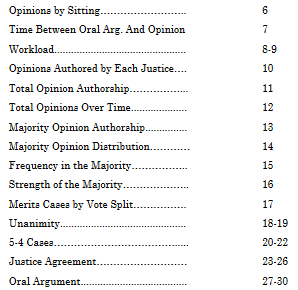

```{r xaringan-logo, echo=FALSE}
xaringanExtra::use_logo("https://drive.google.com/uc?id=1WbdosVvi6SBjYtEF6kHj-f0wotdHMRgw",link_url = "https://civicdatalab.in",exclude_class = NULL)
```

```{r xaringan-fit-screen, echo=FALSE}
xaringanExtra::use_fit_screen()
```

```{r xaringan-tile-view, echo=FALSE}
xaringanExtra::use_tile_view()
```

```{r xaringan-tachyons, echo=FALSE}
xaringanExtra::use_tachyons()
```

# What we will .bg-red[not] cover

1. This is not an introduction to Statistics
2. No, we'll not learn AI and ML
3. We will not learn about using the Microsoft Excel Analytics ToolPak addin
4. We will not use any additional analytical tools like Stata or SPSS to analyse data

---

# What .bg-green[we will cover] instead

1. In what ways can analysis of legal data help us
2. Common challenges with any data analysis project
3. Asking the right questions 
4. Data Analysis use cases
  1. Court Performance
  2. Case level analytics
  3. Comparing entities - Creating Indices
  4. Conducting Surveys in the Digital Age
  5. Text Based Analysis
  6. Criminal Justice Data Explorer - Commons Project
  7. Human Rights Data Analysis Group (HRDAG)
  8. FBI Crime Data Explorer
5. How can we analyse the data in an un-biased way
6. The methodology matrix - What to use when

---

# Analysing legal data can help us in

1. Understanding how the judiciary functions
2. Creating more accountable institutions
3. Analysing the structural capacity of justice system across the country
4. Designing evidence-based judicial reforms
5. Designing better court/case management practices
6. Predict/Simulate the impact of laws on different stakeholders
7. Re-engineering judicial processes

and the list continues .... 

---

# But there are hurdles to cross

## Challenges associated with most data driven engagements that can lessen the intended impact:

1. Availability of granular datasets
2. Bias in data collection and analysis
3. Beneficiaries not in alignment with the proposed outcomes
4. Having a multidisciplinary team that: 
  1. Understands the context
  2. Has the right set of skills to analyse data
  3. Can publish with purpose
5. Ethical use of datasets

and the list continues as well .. 
 
---

# It starts with asking the right questions

> If I had only one hour to save the world, I would spend fifty-five minutes defining the questions, and only five minutes finding the answers. 

- Albert Einstein

[The 100 Questions project](https://the100questions.org/about.html) by [The GovLab](https://www.thegovlab.org/)


## The 100 Questions Project - Initiatives

1. [Migration](https://migration.the100questions.org/)
2. [Gender](https://gender.the100questions.org/)
3. [Governance](https://governance.the100questions.org/)

Other initiatives can be explored at [https://the100questions.org/](https://the100questions.org/about.html)

---

# Data Analysis - Use-Cases

---

## Analysing Court Performance

.pull-left[.card[
[](https://harvardlawreview.org/category/statistics/)
]
]

.pull-right[.card[
[](https://www.courtstatistics.org/csp-stat-nav-cards-first-row/csp-stat-civil)
]

[Report](https://www.courtstatistics.org/__data/assets/pdf_file/0014/40820/2018-Digest.pdf) [Dashboard](https://www.courtstatistics.org/interactive-data-displays-nav-cards-first-row/pandemic-data)
]

---

### Supreme Court - Statistics Pack

.pull-left[
.card[

[United States ( _SCOTUS blog_ )](https://www.scotusblog.com/2020/07/final-stat-pack-for-october-term-2019/)
]
]

.pull-right[
.card[

[India ( _by CLPR_ )](https://scobserver-production.s3.amazonaws.com/uploads/ckeditor/attachments/440/Statistics_Pack_SCO.pdf)
]
]

Other Analysis:

- [A Quantitative Analysis of the Indian Supreme Court Workload - Nick Robinson](https://www.cprindia.org/sites/default/files/articles/SSRN-id2189181.pdf)

---


# Resources

[Statistics for lawyers](http://ndl.ethernet.edu.et/bitstream/123456789/63099/1/348.pdf)
[OpenIntro - Statistics](https://www.openintro.org/book/os/)
[The Summer Institutes in Computational Social Science - SICSS](https://sicss.io/overview)

---

class: center, middle

# Queries and Feedback
