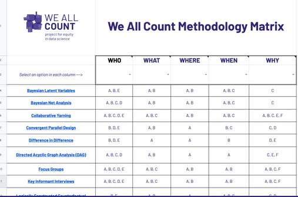

```{r xaringan-logo, echo=FALSE}
xaringanExtra::use_logo("https://drive.google.com/uc?id=1WbdosVvi6SBjYtEF6kHj-f0wotdHMRgw",link_url = "https://civicdatalab.in",exclude_class = NULL)
```

```{r xaringan-fit-screen, echo=FALSE}
xaringanExtra::use_fit_screen()
```

```{r xaringan-tile-view, echo=FALSE}
xaringanExtra::use_tile_view()
```

```{r xaringan-tachyons, echo=FALSE}
xaringanExtra::use_tachyons()
```

```{r xaringan-themer, include=FALSE, warning=FALSE}
library(xaringanthemer)
style_mono_accent(base_color = "#2A9D8E",colors = c(
  red = "#f34213",
  purple = "#3e2f5b",
  orange = "#ff8811",
  green = "#136f63",
  white = "#FFFFFF"
))
```

# Data Analysis Methodologies

## What to use when

.pull-left[
.card[
_It can be hard to know which methodology to use when designing a data project. The most important thing for the success of your selection (and equity) is to make sure that your chosen methodology matches the kinds of research questions you have._
]

Read more [here](https://heatherkrause.medium.com/the-methodology-matrix-how-to-not-get-bullied-blindsided-or-bored-when-designing-your-data-d34f16963b1e)

]

.pull-right[
.card[


Methodology Matrix - [Link](https://weallcount.com/methodology-matrix/)

]]

---

# Resources


---

class: center, middle

# Queries and Feedback
