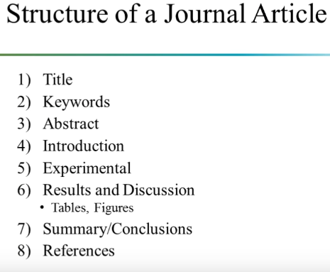
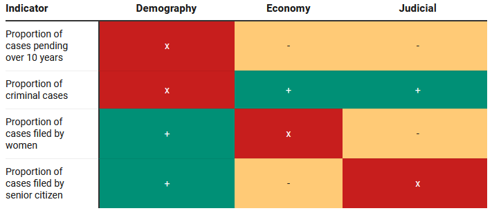

```{r xaringan-logo, echo=FALSE}
xaringanExtra::use_logo("https://drive.google.com/uc?id=1WbdosVvi6SBjYtEF6kHj-f0wotdHMRgw",link_url = "https://civicdatalab.in",exclude_class = NULL)
```

```{r xaringan-fit-screen, echo=FALSE}
xaringanExtra::use_fit_screen()
```

```{r xaringan-tile-view, echo=FALSE}
xaringanExtra::use_tile_view()
```

```{r xaringan-tachyons, echo=FALSE}
xaringanExtra::use_tachyons()
```

```{r xaringan-themer, include=FALSE, warning=FALSE}
library(xaringanthemer)
style_mono_accent(base_color = "#2A9D8E",colors = c(
  red = "#f34213",
  purple = "#3e2f5b",
  orange = "#ff8811",
  green = "#136f63",
  white = "#FFFFFF"
))
```

# Data Analysis Methodologies

## What to use when

.pull-left[
.card[
_It can be hard to know which methodology to use when designing a data project. The most important thing for the success of your selection (and equity) is to make sure that your chosen methodology matches the kinds of research questions you have._
]

Read more [here](https://heatherkrause.medium.com/the-methodology-matrix-how-to-not-get-bullied-blindsided-or-bored-when-designing-your-data-d34f16963b1e)

Access the matrix [here](https://docs.google.com/spreadsheets/d/18bnDbBW5waEGZ0UNiQlbDq7hf32l5ag7HR1uvDqhMmI/edit?usp=sharing)
]

.pull-right[
.card[


Methodology Matrix - [Link](https://weallcount.com/methodology-matrix/)

]]
---
class: center, middle

# Reading empirical legal research

---

## Structure of a journal article

.center[.middle[

]]

---

## Surveying a paper

**One of the ways**

1. Read the title and keyword

--

2. Read the abstract

--

3. Jump to the conclusions

_The first 3 steps will help you decide, if reading the paper in detail is worth it or not!!_

---

## Reading the paper

4. Look at the tables and figures (including captions). _Might be helpful before we dig into the details which will slow down the reading._

--

5. Read the Introduction section _Background information, why the study was done.._

--

6. Read the Results and Discussion section

--

_If the research is really relevant then_

7. Read the experimental section -  _The How's, to understand what was done to better understand the meaning of data and its interpretation.. _

---

## Other tips

1. Develop a system of note-taking that is easy to access.

--

2. Learn about [Notion](https://www.notion.so/) , [Obsidian](https://obsidian.md/) or a bunch of other documentation tools that suit your needs. 

--

.center[.card[.bg-green[.white[The faintest writing is better than the best memory]]]]

---
class: center, middle

# Analysis - Deep Dive

---

## SocioEconomic Indicators and Case Pendency

.center[
.card[
.bg-green[.white[Does economic growth reduces case pendency ?]]
]
]

--

.pull-left[

.center[**Objective**]

.card[
Explore how _socioeconomic indicators_ affect

1. Proportion of cases pending for more than 10 years
2. Proportion of pending cases classified as criminal 
3. Proportion of pending cases filed by women 
4. Proportion of pending cases filed by senior citizens

]
]

--

.pull-right[

.center[**Data Sources**]

.card[

1. National Judicial Data Grid (NJDG) - Civil  and  criminal  cases  filed  and  pending
2. Demographic  information  from  the  annual  population  Census  of  India,  2011
3. GDP data from Planning Commission and MOSPI

]
]

---
### Features

1. Final dataset covers a total of 496 districts over 25 States

--

2. Socioeconomic and structural factors include:
  1. Judicial factors – number of judges per court and courts per district
  2. Economic factors - per capita GDP, degree of urbanisation, household assets ownership, proportion of working population 
  3. Social factors - age, education, literacy levels, social identities based on caste, religion and gender of litigants.

--

3. The study only traces the association between socioeconomic factors and proportion of  pendency and does not indicate any causal relationships between them. 

--

4. Uses Cross sectional data ( _Data collected at one point in time_ ) instead of panel data ( _Data collected over time_ ) 

---
### Findings

.center[
.middle[
.card[

]
]
]
---
### Methodology

Primary Method - **Ordinary least square regressions**

For checking the robustness of selected methodology:

1. Logarithmic Transformations
2. Heteroskedasticity
3. Cooks distance for treating outliers

---
### Dataset and Other Resources

1. Research Paper - [Link](https://www.nls.ac.in/wp-content/uploads/2021/08/Justice-delayed_empirical-study-1.pdf)
2. Datasets - [Link](https://www.dropbox.com/sh/
cy16c9x3fpsdngx/AABvLM7WE3Pm6SJLfgqphb0qa?dl=0)
3. Author Details and Paper Summary - [Link](https://www.nls.ac.in/news-events/justice-delayed-a-district-wise-empirical-study-on-indian-judiciary/)
4. Journal of Indian Law and Society - [Link](https://jils.co.in/)

---
## Jobs for Justice

.card[
.center[
.bg-green[.white[Whether judges respond to .yellow[pandering incentives] by ruling in favour of the government in the hope of receiving jobs after retiring from the Court ?_
]
]
]
]

--

**Variables that influence incentives**
.card[
1. The importance of a case
2. Whether the judge retires with enough time left in a government's term (at-least 47 weeks) to be rewarded with a prestigious job
3. Authoring judgements in favour of the government
]

---

## Data Sources

1. All reported **Supreme Court of India cases** involving the government from 1999 till 2014
  1. Total 2,605 cases
  2. 941 cases with judgements
  3. 742 cases decided by a 2 judge bench (random allocation)
  4. Both judges retire before March 2015  - 687 cases
  5. One of the two judges write a judgement - 681 cases
  6. Decision was unambiguously for or against the government - 652 cases

--

2. **Data on Judges**
  1. Date of appointment
  2. Date of retirement
  3. Date of elevation to CJI
  4. Date of birth

--

3. **Jobs Data** - Collected using Gazette of India, Newspaper reports
  1. Position
  2. Date of appointment

---
## Features

1. Examining how judicial decisions are affected by factors unrelated to legal reasoning

--

2. Identify and measure corruption at an aggregate institutional level

--

3. Identify the **causal effect** of career-concern incentives on judicial decision-making

---
## Findings

.center[.middle[.card[
We observe that the government has a **14-27% chance of winning a case** that is one standard deviation higher than mean importance that is decided by a bench with both judges retiring shortly before an election. Our estimates imply that the probability of the government **winning such a case more than doubles** when it is instead decided by a bench with both judges retiring long before an election.
]
]
]

---
## Methodology

1. Statistically identify (using OLS) the presence of pandering by comparing benches composed of judges
who have stronger incentives to pander to those who have weaker incentives to pander

--

2. Construct an index for measuring the importance of a case by identifying the number of:
  1. Attorneys General
  2. Solicitors General
  3. Senior Advocates, and
  4. Advocates that appeared in the case

--

3. Treatment and Control groups
  1. Benches with two judges retiring long before an election as the **high treatment group**"
  2. Those with just one judge retiring long before an election as the **low treatment group** 
  3. Those with both retiring shortly before an election as the **control group**
  

---
## Dataset and other resources

1. Research Report - [Link](https://justicehub.in/dataset/jobs-for-justice-s-corruption-in-the-supreme-court-of-india/resource/d42a662f-f6a0-4092-bc87-c4b9dbd739cb)
2. Authors website - [Link](http://www.mysmu.edu/faculty/madhavsa/)
3. Paper summary - [IdeasofIndia](https://www.ideasforindia.in/topics/governance/the-politics-of-post-retirement-appointments-corruption-in-the-supreme-court.html)
4. Media Coverage - [ThePrint](https://theprint.in/judiciary/ranjan-gogoi-rs-seat-made-big-news-in-2020-but-he-is-among-70-sc-judges-with-retirement-gigs/576154/)

---
class: center, middle

# Tools

---

## Documenting Qualitative Info

.pull-left[
.card[
[](https://www.uwazi.io/)
]
]

.pull-right[

.center[**Features**]

.card[

1. Open Source
2. Data collection, exploration and analysis at one place
3. Can be used to store much more rich information, like reports, articles (full-text), audio/video files for every entry
4. Securely store, organise, and publish document collection to make the stories within it more accessible and understandable to a wider audience
5. Establish relationships between responses/entities

]
]

---

### UWAZI Use-Cases

1. Using Uwazi to improve access to decisions issued by human rights courts and commissions - [Link](https://summa.cejil.org/)

--

2. Database and commentary on jurisprudence of the African Court on Human and Peoples' Rights - [Link](https://afchpr-commentary.uwazi.io/en/)

--

3. Pakistan's Death Penalty Database - [Link](https://data.jpp.org.pk/)

--

More info [here](https://www.uwazi.io/make-important-public-info-more-accessible/)

---

# Resources

1. [Putting data back into context](https://datajournalism.com/read/longreads/putting-data-back-into-context)
2. Learning How to Learn: Powerful mental tools to help you master tough subjects - [Link](https://www.coursera.org/learn/learning-how-to-learn)
3. [How to Read a Paper Efficiently (By Prof. Pete Carr)](https://www.youtube.com/watch?v=IeaD0ZaUJ3Y)
4. [How to lie with indices](https://www.economist.com/leaders/2014/11/08/how-to-lie-with-indices)

---

class: center, middle

# Queries and Feedback
