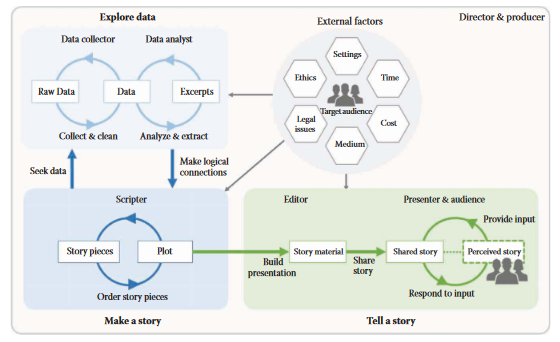
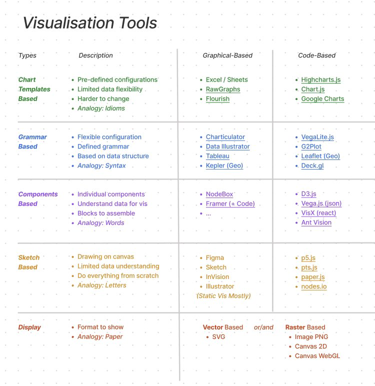
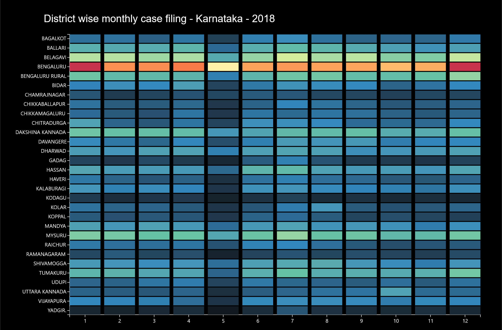
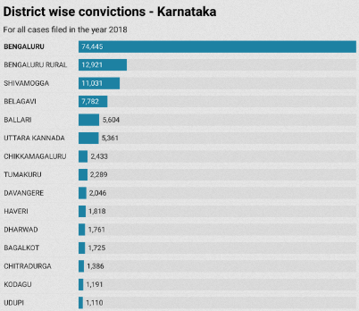
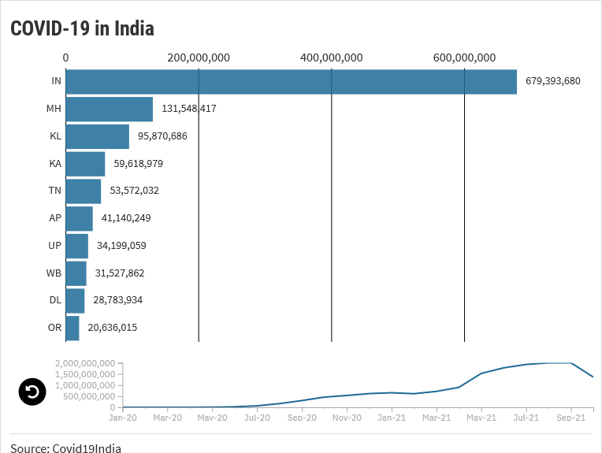
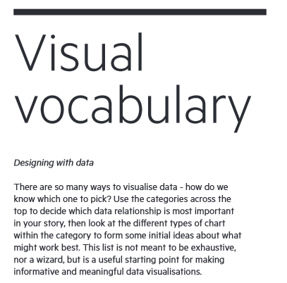
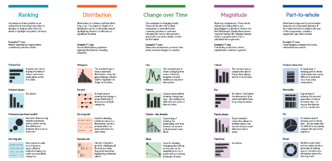

```{r xaringan-logo, echo=FALSE}
xaringanExtra::use_logo("https://drive.google.com/uc?id=1WbdosVvi6SBjYtEF6kHj-f0wotdHMRgw",link_url = "https://civicdatalab.in",exclude_class = NULL)
```

```{r xaringan-fit-screen, echo=FALSE}
xaringanExtra::use_fit_screen()
```

```{r xaringan-tile-view, echo=FALSE}
xaringanExtra::use_tile_view()
```

```{r xaringan-tachyons, echo=FALSE}
xaringanExtra::use_tachyons()
```

```{r xaringan-themer, include=FALSE, warning=FALSE}
library(xaringanthemer)
style_mono_accent(base_color = "#0E273C",colors = c(
  red = "#f34213",
  purple = "#3e2f5b",
  orange = "#ff8811",
  green = "#136f63",
  white = "#FFFFFF"
),link_color = '#F75C03')
```

# RECAP

Topics covered in the last session:

1. The data viz quadrant
2. What restricts us from visualising data
3. Data viz storytelling components **Story | Audience | Medium**
4. Activity - Building a narrative
5. Activity - Reading a data viz
6. Building accessible data visualisations - Check the [Chartability project](https://chartability.fizz.studio/)
7. How to select the most appropriate graph for your data
8. Things to avoid when developing visualisations
9. Information sharing framework when working with external consultants on data viz projects

<br/>
<br/>

-----


.center[
[**Slides**](https://civicdatalab.in/Working-with-Data-Workshops/modules/module_4_data_viz/session-1/session-1.html) | [**Video**](https://youtu.be/qieuVFrFxRo)
]

-----


---

# The data viz storytelling process

.center[
 

_The  storytelling  process  from  the  story  idea  to  visually  shared  
stories._<sup>1</sup>

]
.footnote[
[1][Data Driven Storytelling](https://medium.com/nightingale/data-driven-%3Cmark%3Estorytelling%3C/mark%3E-a-short-review-93926262a74a)
]

---
class: center, middle

# Data Viz - The Tooling Landscape

---
class: center, middle


---
class: center, middle

# Static viz

---

# Charticulator

.center[**Objective** : Plot month wise cases for all districts of Karnataka from the year 2018]


.pull-left[

[](https://charticulator.com/)

.center[

Charticulator is a project from Microsoft Research.

]

]

.pull-right[

]

------

.center[

**[Tool](https://charticulator.com/) | [Dataset]((datasets/KA_2018_monthly_cases_districts.csv)**

]

------

---

# DataWrapper

.center[**Objective** : Plot district wise total conviction cases for all districts of Karnataka from the year 2018]


.pull-left[

[](https://app.datawrapper.de/)

.center[

Datawrapper helps some of the world’s best teams to tell their stories with data.
]

]

.pull-right[
[](https://www.datawrapper.de/_/yGrFO/)
]

------

.center[
**[Tool](https://app.datawrapper.de) | [Dataset](datasets/KA_2018_district_wise_convictions.csv)**
]

------

---
class: center, middle

# Dynamic (or Interactive) viz

---

# Flourish

.center[
**Objective** : Plot the spread of COVID-19 across states from Jan, 20 - Oct, 21
]


.pull-left[

[](https://flourish.studio/)

.center[
Beautiful and easy data visualization and storytelling
]
]

.pull-right[
[](https://app.flourish.studio/visualisation/7586483/edit)
]

------
.center[
**[Tool](https://app.flourish.studio/) | [Dataset](datasets/covid_data_transposed.csv)**
]

------

---

## COVID-19 Dynamic Data Viz

<iframe src='https://flo.uri.sh/visualisation/7586483/embed' title='Interactive or visual content' class='flourish-embed-iframe' frameborder='0' scrolling='no' style='width:100%;height:600px;' sandbox='allow-same-origin allow-forms allow-scripts allow-downloads allow-popups allow-popups-to-escape-sandbox allow-top-navigation-by-user-activation'></iframe><div style='width:100%!;margin-top:4px!important;text-align:right!important;'><a class='flourish-credit' href='https://public.flourish.studio/visualisation/7586483/?utm_source=embed&utm_campaign=visualisation/7586483' target='_top' style='text-decoration:none!important'> </a></div>
---
# Maps

---

# Infographics

---


# Dashboards

---

# Storytelling conventions for better data viz

https://medium.com/nightingale/how-to-use-storytelling-conventions-to-create-better-visualizations-45177ae517ba
---

# Resources - To select a chart

.pull-left[

]

.pull-right[
[](https://raw.githubusercontent.com/Financial-Times/chart-doctor/main/visual-vocabulary/poster.png)

1. [From Data to Viz](https://www.data-to-viz.com/)
2. [FT - Visual Vocabulary](https://raw.githubusercontent.com/Financial-Times/chart-doctor/main/visual-vocabulary/poster.png)

]
---

# Other Resources

.pull-left[

### Creating accessible data viz

- The [Chartability project](https://chartability.fizz.studio/)
- [Accessibility Features Demo - HighCharts](https://www.highcharts.com/accessibility/)

### 

]

.pull-right[

1. [Creating responsive data visualisations](https://www.gurmanbhatia.com/talk/2020/11/28/responsive-data-viz-phone.html)

]
---
class: center, middle

# Queries and Feedback
