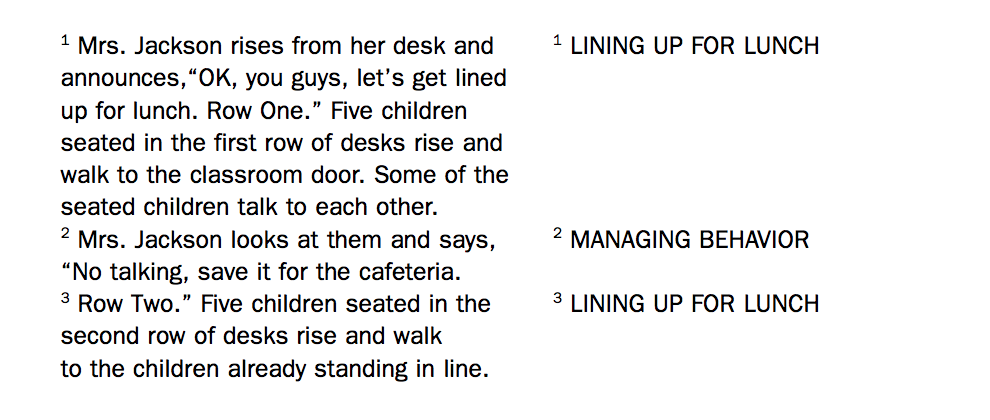
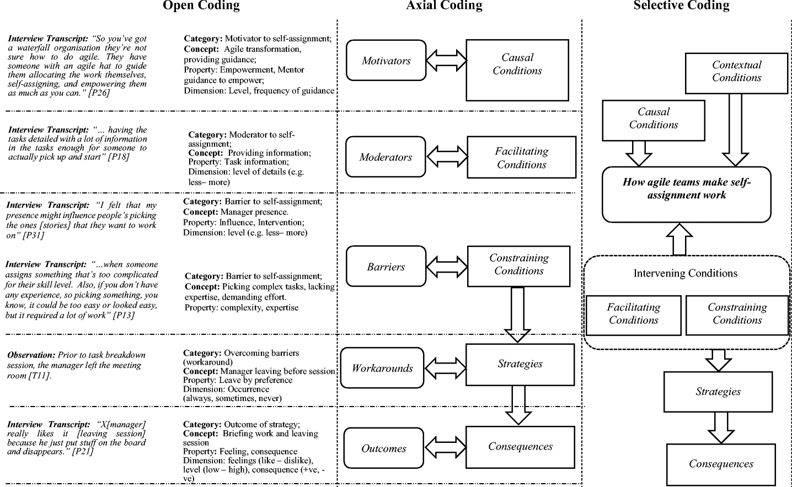

```{r xaringan-logo, echo=FALSE}
xaringanExtra::use_logo("https://drive.google.com/uc?id=1WbdosVvi6SBjYtEF6kHj-f0wotdHMRgw",link_url = "https://civicdatalab.in",exclude_class = NULL)
```

```{r xaringan-fit-screen, echo=FALSE}
xaringanExtra::use_fit_screen()
```

```{r xaringan-tile-view, echo=FALSE}
xaringanExtra::use_tile_view()
```

```{r xaringan-tachyons, echo=FALSE}
xaringanExtra::use_tachyons()
```

```{r xaringan-themer, include=FALSE, warning=FALSE}
library(xaringanthemer)
style_mono_accent(base_color = "#E57C04",colors = c(
  red = "#f34213",
  purple = "#3e2f5b",
  orange = "#ff8811",
  green = "#136f63",
  white = "#FFFFFF"
),link_color = '#C3423F')
```


# Qualitative Data Analysis

.center.middle[

]

---

# Content Analysis - The Process

**Step 1** - Conducting the Interview

--

**Step 2** - Transcribing interviews

--

**Step 3** - Assigning Codes to each interview

--

**Step 4** - Analysing Codes

--

**Step 5** - .bg-red[.white[Repeat the process]]

---

# Coding in Qualitative Data Analysis

.center.middle[

]

---

# What is a code

.center[.middle[

> A code in qualitative inquiry is most often a word or short phrase that symbolically assigns a summative, salient, essence -capturing, and/or evocative attribute for a portion of language-based or visual data <sup>1</sup>

]
]

.footnote[

[1][An Introduction to Codes and Coding](https://www.sagepub.com/sites/default/files/upm-binaries/24614_01_Saldana_Ch_01.pdf)

]

---

## Codes and Coding

1. Creating the Codes is an **iterative process** for a qualitative researcher.

--

2. They will often **change, lump together, split or re organize** codes as they go through more and more data.

--

3. The first round of coding can be **very open-ended**, but the codes can get more specific in additional rounds. For E.g. A conversation between two people can be tagged as _A-B_ in the first round, _A-B - Access to Courts_ in the second and _A-B - Access to Courts - Financial Hurdles_ in the third

--

4. Later rounds involve **conflating codes** that might mean the same thing, **relating codes** to one another, and **eliminating codes** that no longer make sense.


---
# Grounded Theory - Case Study


.bg-washed-red.b--dark-red.ba.bw2.br3.shadow-5.ph4.mt5[

.center[
.middle[

#### How agile teams make self-assignment work <sup>1</sup>

]

]

]


.footnote[
[1][How agile teams make self-assignment work: a grounded theory study](https://link.springer.com/article/10.1007%2Fs10664-020-09876-x)
]

---

## Research - Making self assignment work

.pull-left[

**Features**

1. Data collected through interviews with 42 participants representing 28 agile teams from 23 software companies and supplemented these interviews with observations. 
2. Coding procedures used - **Open**, **Axial**, and **Selective coding**
3. Grounded Theory builds on research question which is open ended and drives the direction of research.

]

--

.pull-right[

**Results**

To understand how self-assignment works, the study shares insights on:

1. Context 
2. Causal conditions that give rise to the need for self-assignment
3. A set of facilitating conditions that mediate how self-assignment may be enabled
4. A set of constraining conditions that mediate how self-assignment may be constrained 
5. Strategies applied by agile teams to make the central phenomenon, self-assignment, work. 

]

---

## Process

.pull-left[


]

--

.pull-right[

**Note**

1. Iterative data collection. Data collection, followed by interviews, followed by data collection.

2. Each phase includes **multiple iteration of data collection and analysis**

3. Data for each round was analysed before collecting more data until the point of **theoritical saturation**

4. The objective of Phase 1 is **different** from Phase 2 

5. The primary data sources for phase1 were _face-to-face interviews_ and for phase2 were _pre-interview questionnaires_, _face-to-face semi-structured interviews_, and _team observations_ 

]

---

## Phase 1 - Data Analysis

1. The data collected helped in **developing an initial understanding** of task allocation in agile teams. 

--

2. We applied open coding on participants’ transcribed interview responses. During open coding, we **labelled the data with short phrases** that summarize the main key points. 

--

3. These were **further condensed into two to three words**, captured as codes. 

--

4. As a result of data analysis, **different concepts from similar codes emerged**, one the most prominent of which was task allocation through self-assignment. Others included manager-driven, manager-assisted, team-driven, and team-assisted task allocation. 

--

5. The **results of phase1 directed us to focus on self-assignment** as the substantive area of the study in the next phase.

---

## Phase 2 - Data Analysis



---

## Process Terminologies

.card[
.center[.middle[


]
]
]

---

## Applying the coding paradigm to data collected

.center[.middle[

]
]

---

## Building a theory - Selective Coding

1. In Selective Coding, we **started building a storyline** presenting the essence of our study where each sub-category and category captured a part of the whole story of making self-assignment work. 

--

2. How agile teams make self-assignment work emerged as the **most prominent and central phenomenon** from our data analysis process 

--

3. It was during the selective coding, we confirmed which [relational phrases](https://link.springer.com/article/10.1007/s10664-020-09876-x/figures/5) such as ‘mediates’, ‘overcome by’, ‘give rise to’ were fitting well to our entire theory model

--

4. It was also during the selective coding, when **theoretical saturation was reached** and no new concepts, categories or insights were identified. 

--

5. Then, finally we **revisited and refined the categories to make sense of the entire theory** explaining the phenomenon.

---

# The state of QDA tools

1. Not many good open source tools available

--

2. Some popular tools are [NVIVO](https://www.qsrinternational.com/nvivo-qualitative-data-analysis-software/home), [Atlas TI](https://atlasti.com/), [MAX QDA](https://www.maxqda.com/), etc. Links to other similar tools are available [here](https://docs.ropensci.org/qcoder/articles/articles/motivation.html)

--

3. All of these offer way more features than what is usually needed in an analysis

--

4. Might be difficult to combine the output from these tools with other tools when doing quantitative data analysis, data visualisations, etc. 

--

5. Open Source Tools like [qcoder](https://github.com/ropenscilabs/qcoder/), [Taguette](https://www.taguette.org/), etc are available but are still under active development and might not be stable yet. 


---
class: center, middle

# Open Data Publication

---

## What can be published

1. Raw datasets sourced by mining public websites

--

2. RTI responses

--

3. Aggregated statistics

--

4. Data collected using primary methods like surveys, etc

--

5. The process of data collection

--

6. Metadata - Information about the data

--

7. Observations and Experiences about working with data

---

## How to publish

1. Choosing a License under which data will be published. [List](https://docs.justicehub.in/license.html) of open data licences.

--

2. Prepare a data dictionary, or a [data biography](https://civicdatalab.in/Working-with-Data-Workshops/modules/module_1_data_collection/session-1.html?panelset6=difference2&panelset7=tidy-dataset3&panelset8=formatted-table2&panelset9=errors2&panelset10=what2&panelset11=importdata2#6)

--

3. Explicitly mention how other users can cite the authors/publishers when using the dataset. [Example](https://www.devdatalab.org/judicial-data)

--

4. Publish raw data and processed data as separate files and detail out the entire process one needs to follow to prepare the processed files from the raw datasets

--

5. Include a document that mentions about the current state of data, update frequency, data-gaps, project-scope, etc.

--

6. Mention about all stakeholders involved in the entire process - collaborators, funders, etc.

--

7. Publish all relevant code that is needed to mine or process the datasets. 

--

8. A central repository to access all publications/datasets is useful.

---
class: center, middle

# The JALDI Portal

.bg-washed-red.b--dark-red.ba.bw2.br3.shadow-5.ph4.mt5[

The portal was built with the aim of making available data on the judiciary to researchers, policy makers and the general public who are interested in understanding the working of the judiciary.

]

---
class: center, middle

# The JALDI Portal - Challenges and Workarounds

---
class: center, middle

# Queries and Feedback
